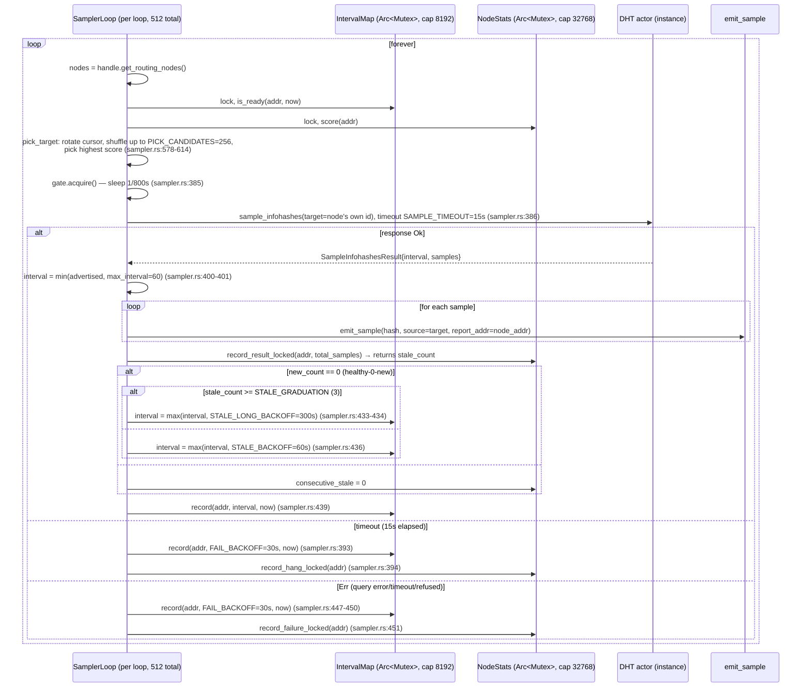
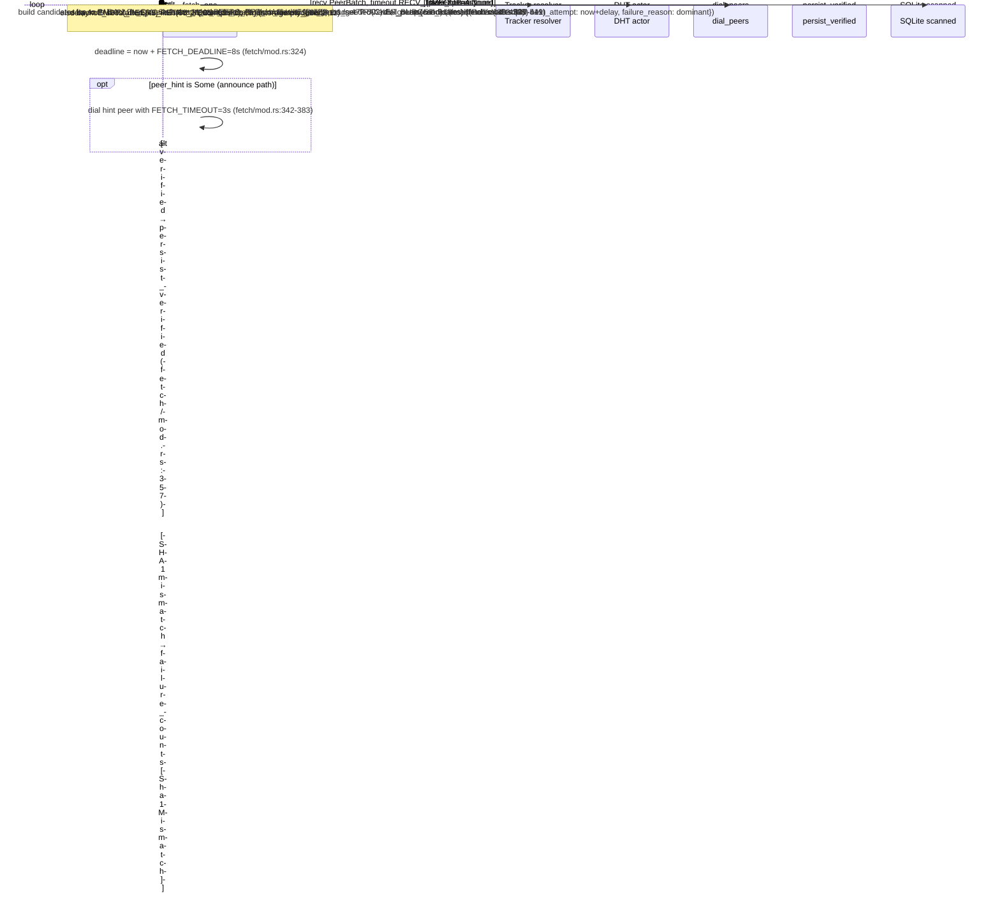

# Crawler Architecture — as the code exists today

> **Source of truth**: this document was written by reading the code directly at the commit
> range of the current tree. Every claim cites `file:line`. Where a flow is uncertain or the
> code disagrees with a prior description, that is stated explicitly rather than smoothed over.
>
> Generated 2026-08-14 from the working tree (post-`7343e68`, `926cb54`).

---

## 0. Process model

One **crawler** process runs inside the `crawler` container (shared network namespace with
`gluetun` WireGuard tunnel). It is a single tokio multi-thread runtime (`#[tokio::main]`,
`main.rs:26`) with N = **8** independent DHT "instances" plus one shared fetch pipeline and one
shared storage writer. All instances share one process, one SQLite DB, one Redis connection,
one in-process bloom filter, and one liveness counter.

The binary entrypoint (`main.rs:26-39`) dispatches on subcommand: `run`, `query`, `purge`,
`snapshot`, `bench-fetch`. Only `run` is used in production (`docker-compose.yml:85`).

---

## 1. Component inventory (long-running tasks/loops)

All tasks below are spawned inside `crawler::run` (`crawler.rs:63`) unless noted. "Live count"
is at the **deployed config**: `--instances 8 --scale 1 --min-seen 1 --min-seen-shadow 3
--max-nodes 8192 --max-attempts 2 --no-restrict-ips` (`docker-compose.yml:92-102`), not `--aggressive`.

| # | Loop / task | Spawned at | Count live (8 instances, scale 3) | Owns / mutates |
|---|---|---|---|---|
| 1 | DHT actor per instance | `crawler.rs:104` → `discovery::start_dht` → `DhtHandle::start` (`actor.rs`) | **8** (one per instance) | Per-instance: `routing_table` (`parking_lot::RwLock<RoutingTable>`), `pending` (`DashMap<u16,PendingQuery>`), `active_lookups` (`HashMap<Id20,JoinHandle>`), `announce_tokens` (`HashMap` + `VecDeque` order, cap 4096 `actor.rs:930`), `sample_replies`, `peer_store`, `item_store`, `ip_voter`, one `UdpSocket` bound to `port+i` |
| 2 | Routing grower per instance | `crawler.rs:115-122`, `interval=250ms` | **8** | Calls `handle.get_peers(random)`; **drops the reply channel immediately** (`discovery/mod.rs:164`) so the DhtLookup fast-exits after ~2 responses. Owns nothing persistent. |
| 3 | Sampler per instance (`Sampler::run`) | `crawler.rs:217-231` | **8** | Each spawns `effective_sampler_loops` **= 64** `SamplerLoop` tasks (`sampler.rs:291`) → **512 sampler-loop tasks total** |
| 4 | `SamplerLoop::run_loop` (×64 per instance) | `sampler.rs:310` | **512** | Shares per-instance `Arc<Mutex<IntervalMap>>` (cap 8192 `sampler.rs:35`) and `Arc<Mutex<NodeStats>>` (cap 32768 `sampler.rs:37`) via clone. Owns a per-loop `cursor: usize`. |
| 5 | Passive intake per instance | `crawler.rs:237-254` → `run_passive_intake` | **8** | Subscribes to `handle.subscribe()` broadcast; drains `DhtEvent::Announced`/`LookedUp` into `hash_tx`. Owns nothing persistent. |
| 6 | Fetch pool (`run_fetcher`) | `crawler.rs:261-273` | **1** (shared across instances) | Owns `HashQueue` (`BinaryHeap<(bool,u32,Id20)>` + `HashMap<Id20,FetchRequest>`), `in_flight` (`Arc<Mutex<HashSet<Id20>>>`), `dead_peers` (`Arc<Mutex<DeadPeerCache>>`, 2-failure/600s), `lookup_permits` (`Semaphore` = 384). Spawns up to `concurrency` **= 1536** `fetch_one` tasks. |
| 7 | Storage writer (`write_loop`) | `crawler.rs:275` | **1** | Batches `TorrentRecord`s (batch 256, flush 2s) → SQLite. |
| 8 | Stats loop (`stats_loop`) | `crawler.rs:277` | **1** | Reads atomics + DHT stats every 30s; logs "crawl stats". |
| 9 | Liveness sweep | `crawler.rs:157-215` | **1** | Every 30s calls `liveness.sweep()`, feeds shadow counters. |
| 10 | DhtLookup tasks (transient) | actor `start_get_peers_inner` (`actor.rs:2140+`), grower, sampler | ~hundreds transient; `active_lookups` counts | Each owns `nodes: Vec<TrackedNode>` (cap 64), `queried_addrs: HashSet`, `FuturesUnordered<QueryFuture>`, streams `PeerBatch` on `peer_tx`. |
| 11 | Tracker resolution | per `fetch_one` call, `fetch/mod.rs:392-445` | transient (bounded by fetch pool) | Owns per-call UDP sockets + a static shared `reqwest::Client` (HTTP(S)). |
| 12 | Redis `SharedState` | `crawler.rs:70` (`init_shared`) | 1 connection (ConnectionManager) | No background loop; best-effort synchronous commands from callers. |

**Instance count note**: there is no `--aggressive`, so effective values are the non-aggressive
path (`cli.rs:237-284`):
`effective_sampler_qps = min(400×3, 800) = 800`; `effective_sampler_loops = min(32×3, 64) = 64`;
`effective_concurrency = 512×3 = 1536`; `effective_lookup_concurrency = min(256×3, 384) = 384`;
`effective_qps = 2000`; `effective_max_nodes = 8192`; `effective_query_timeout = 3`;
`effective_min_seen = 1`.

⚠️ `effective_sampler_qps` is **per instance** (`Sampler::run` creates its own `QpsGate` at
`sampler.rs:282`), so total theoretical sampler budget is 8×800 = 6400 qps; the *shared* DHT
rate limiter is per-instance too (`actor.rs:987`, rate = `effective_qps` = 2000). In practice
sampling is table-bound, not QPS-bound (see §6).

---

## 2. Data-flow diagram (one infohash, all four entry paths)

```mermaid
flowchart TD
    subgraph Discovery
        S[SamplerLoop ×512<br/>pick_target → sample_infohashes<br/>sampler.rs:356-455]
        A[DHT actor inbound<br/>announce_peer<br/>actor.rs:1458]
        L[DHT actor inbound<br/>get_peers<br/>actor.rs:1407]
        G[Grower ×8<br/>random get_peers<br/>discovery/mod.rs:148]
    end

    S -->|SampleInfohashesResult.samples| ES[emit_sample<br/>sampler.rs:461]
    ES -->|"liveness.record()"| LV[LivenessCounter DashMap<br/>liveness.rs:131]
    ES -->|"bloom.contains(hash)"| BF[SharedBloom 2^27 bits k=7<br/>crawler.rs:142]
    ES -->|"storage.scan_status()"| DB1[(SQLite scanned)]
    ES -->|"shared.seen_contains()"| R1[(Redis dht:seen)]
    ES -->|FetchRequest{source:Sampled, lookup_seed}<br/>sampler.rs:544-554| Q[(hash_tx mpsc 8192×3)]

    A -->|DhtEvent::Announced<br/>discovery/mod.rs:197| PI[run_passive_intake]
    PI -->|announced_contains| R2[(Redis dht:announced)]
    PI -->|FetchRequest{source:Announced, peer_hint}<br/>discovery/mod.rs:215-222| Q

    L -->|DhtEvent::LookedUp<br/>discovery/mod.rs:230| PI2[run_passive_intake]
    PI2 -->|looked_up_contains| R3[(Redis dht:lookedup)]
    PI2 -->|FetchRequest{source:LookedUp}<br/>discovery/mod.rs:245-252| Q

    Q --> FQ[run_fetcher<br/>HashQueue priority<br/>fetch/mod.rs:162]
    FQ -->|fetch_one| F1[fetch_one<br/>fetch/mod.rs:310]

    subgraph Fetch
        F1 -->|peer_hint?| PH[Dial hint directly<br/>fetch/mod.rs:342]
        F1 -->|no hint| TR[Tracker resolution<br/>BEP15 UDP + BEP3 HTTP<br/>fetch/mod.rs:392 / tracker.rs]
        TR -->|peers| DP1[dial_peers<br/>fetch/mod.rs:554]
        F1 -->|get_peers_seeded| DHT2[DhtLookup<br/>actor.rs:2140+ / dht_lookup.rs]
        DHT2 -->|PeerBatch streams| LOOP[get_peers recv loop<br/>fetch/mod.rs:455]
        LOOP -->|peers| DP2[dial_peers]
        PH -->|meta| PV[persist_verified<br/>fetch/mod.rs:645]
        DP1 -->|meta| PV
        DP2 -->|meta| PV
        DP1 -->|fail| FAIL[Failure classification<br/>fetch/mod.rs:525-546]
        DP2 -->|fail| FAIL
    end

    PV -->|TorrentRecord| W[write_loop → SQLite torrents<br/>crawler.rs:310]
    FAIL -->|ScannedRecord| SC[(SQLite scanned<br/>status failed + failure_reason)]
    PV -->|ScannedRecord status=ok| SC
```

---

## 3. Sequence diagrams

### 3a. Sampler loop: pick → query → backoff decision

Constants live in `sampler.rs:18-52`; the branch logic is `sampler.rs:356-455`.



**Backoff constants (current values, `sampler.rs:18-52`):** `FAIL_BACKOFF=30s`,
`STALE_BACKOFF=60s`, `STALE_GRADUATION=3`, `STALE_LONG_BACKOFF=300s`, `INTERVAL_MAP_CAP=8192`,
`NODE_STATS_CAP=32768`, `MIN_LOOP_DELAY=10ms`, `BOOTSTRAP_WAIT=15s`, `PICK_CANDIDATES=256`,
`SAMPLE_TIMEOUT=15s`. `max_interval` is `sampler_max_interval` = **60s** live (`cli.rs:153`,
compose doesn't override).

### 3b. Grower get_peers: spawn → harvest → drain-and-exit

```mermaid
sequenceDiagram
    participant GR as grow_routing (×8, 250ms)
    participant A as DHT actor (instance)
    participant DL as DhtLookup task
    participant RT as RoutingTable (RwLock)

    loop every 250ms (discovery/mod.rs:170)
        GR->>GR: target = random Id20
        GR->>A: handle.get_peers(target) — returns rx, immediately DROPPED (discovery/mod.rs:164)
        Note over A: start_get_peers → start_get_peers_inner (actor.rs:2114-2140)
        A->>DL: spawn DhtLookup (config: max_depth=4, max_nodes=64, actor.rs:2167-2175)
        DL->>DL: if seed_addr set, query it first (dht_lookup.rs:166-170)
        DL->>DL: inject_roots(): routing_table.closest(target, 8) (dht_lookup.rs:262-263)
        loop select
            DL->>DL: process_response(addr, sender_id, gp) (dht_lookup.rs:212)
            DL->>RT: forward_node() → node_tx → checked_insert (dht_lookup.rs:475-477, actor.rs:1218-1220)
            Note over DL: because peer_tx.is_closed() is true (grower dropped rx),
            DL->>DL: drain at most 2 more futures then break (dht_lookup.rs:233-242)
        end
        Note over DL: exits; JoinHandle lands in active_lookups,
        Note over A: maintenance() retains non-finished every 60s (actor.rs:2520-2524)
    end
```

Key facts: the grower is **not** the same as a fetch get_peers — it never reads peers; it only
harvests closer nodes into the routing table. Because the reply channel is dropped immediately,
the DhtLookup processes **1 response then drains ≤2 more futures** (`dht_lookup.rs:236`) before
exiting — so each grower lookup injects nodes from ~1-3 responses. Nodes are injected via
`lookup_node_tx → actor lookup_node_rx → checked_insert` (`actor.rs:1218-1220`).

### 3c. emit_sample gate sequence (per sampled hash)

Source: `sampler.rs:461-565`. Order matters — this is the actual order in code.

```mermaid
sequenceDiagram
    participant ES as emit_sample
    participant LV as LivenessCounter
    participant BF as SharedBloom
    participant ST as Storage (SQLite)
    participant R as Redis SharedState
    participant Q as hash_tx

    ES->>LV: liveness.record(hash, source, now) (sampler.rs:471)
    ES->>ES: new = (New) or (Gained && distinct==1)
    alt min_seen_shadow set (3 live) and live_count >= 3
        ES->>ES: shadow_emitted++; liveness.remove(hash) (sampler.rs:480-487)
    end
    alt bloom.contains(hash)  ← short-circuit
        ES-->>ES: return New/Repeat (sampler.rs:495-497)
    else
        ES->>ST: storage.scan_status(hash) (sampler.rs:498)
        alt status == Ok or Skipped
            ES->>BF: bloom.insert(hash); return (sampler.rs:499-502)
        else status == Failed && attempts >= max_attempts
            ES->>BF: bloom.insert(hash); terminal_dead++; return (sampler.rs:509-516)
        else status == Failed && next_attempt > now
            ES-->>ES: return (backoff, not cached) (sampler.rs:517-519)
        end
        ES->>LV: live_count(hash, now); live_sightings(hash, now) (sampler.rs:517-525)
        alt not corroborated (distinct < min_seen) and not refreshed (discriminator off)
            ES-->>ES: return (sampler.rs:526-533)
        end
        ES->>R: shared.seen_contains(hash) (sampler.rs:537)
        alt already seen fleet-wide
            ES-->>ES: return (sampler.rs:537-539)
        end
        ES->>ES: hashes_unique++ (sampler.rs:541-543)
        ES->>Q: send FetchRequest{source:Sampled, lookup_seed:Some(report_addr)} (sampler.rs:544-554)
        ES->>R: shared.seen_add(hash) (sampler.rs:555)
        ES->>LV: if shadow <= min_seen: liveness.remove(hash) (sampler.rs:560-562)
    end
```

⚠️ The **bloom/DB gate runs BEFORE the liveness-gate threshold check** (code order:
`sampler.rs:495` bloom → `498` scan_status → `517` liveness). A hash already recorded
Ok/Skipped short-circuits before the distinct-source gate is consulted.

### 3d. Full fetch attempt (tracker → DHT → dial → persist, failure branches)

Source: `fetch/mod.rs:310-547` (`fetch_one`), `554-641` (`dial_peers`), `645-685`
(`persist_verified`), `699-718` (`record_peer_failure`), `failure.rs:43-120`.



**dial_peers failure branches** (all recorded to both `failure_counts` and the atomic counter,
`fetch/mod.rs:575-640`):

| Branch | Counter | classification source |
|---|---|---|
| `FetchFailureKind::Timeout` | `connect_timeout` | `Err(_elapsed)` — 3s dial timeout (`fetch/mod.rs:606-617`), also marks peer dead |
| `FetchFailureKind::ConnectRefused` | `connect_refused` | `failure.rs:83` (io::ErrorKind::ConnectionRefused) or string |
| `FetchFailureKind::ConnectionReset` | `connection_reset` | `failure.rs:84` (Reset/Aborted) or string |
| `FetchFailureKind::ConnectionClosed` | `connection_closed` | `failure.rs:85` (UnexpectedEof/BrokenPipe) or string |
| `FetchFailureKind::HandshakeFailed` | `no_bep10` | `failure.rs:102` ("does not support BEP 10") |
| `FetchFailureKind::NoUtMetadata` | `no_ut_metadata` | `failure.rs:104` |
| `FetchFailureKind::MetadataRejected` | `metadata_rejected` | `failure.rs:106` |
| `FetchFailureKind::ParseError` | `parse_error` | `failure.rs:110-115` (invalid message/bencode/handshake/metadata size) |
| `FetchFailureKind::Sha1Mismatch` | `sha1_mismatch` | `fetch/mod.rs:630-636` (SHA-1 of assembled info != hash) |
| `FetchFailureKind::EarlyAbort` | `early_abort` | `fetch/mod.rs:618-623` (24 consecutive dead dials, no handshake) |
| `FetchFailureKind::Deadline` | `fetch_deadline` | `fetch/mod.rs:576-579` (overall 8s deadline) |
| `FetchFailureKind::EmptyPeers` | `empty_peers` | `fetch/mod.rs:525-530` (no peers at all) |
| `FetchFailureKind::Other` | `peer_errors_other` | `fetch/mod.rs:583-588` (JoinError/panic) or `failure.rs:118` fallback |

The **dominant** failure (highest count per hash) is what gets persisted to
`scanned.failure_reason` (`fetch/mod.rs:539-546`).

---

## 4. Config / constants map (live values)

Live values reflect `docker-compose.yml` (`--scale 3`, non-aggressive) + code defaults where
compose doesn't override. Effective values computed by `cli.rs:237-284`.

| Constant / flag | Code default | **Live value** | Where effective value is computed |
|---|---|---|---|
| `--instances` | 1 (`cli.rs:91`) | **8** (`compose:93`) | `crawler.rs:72` |
| `--scale` | 10 (`cli.rs:115`) | **1** (`compose:99`) | `cli.rs:229` |
| `--min-seen` | 1 (`cli.rs:121`) | **1** (`compose:95`) | `cli.rs:283` (non-aggressive → unchanged) |
| `--min-seen-shadow` | 0 (`cli.rs:134`) | **3** (`compose:97`) | — |
| `--min-sightings` | 1 (`cli.rs:128`) | **1** (not in compose) | `sampler.rs:301` |
| `--max-nodes` | 4096 (`cli.rs:161`) | **8192** (`compose:101`) | `cli.rs:273` |
| `--max-attempts` | 2 (`cli.rs:160`) | **2** (`compose:101`) | `sampler.rs` (terminal dead-hash bloom cache) |
| `--sampler-qps` | 400 (`cli.rs:104`) | → **800** (effective) | `cli.rs:238-240` (`min(400×3, 800)`) |
| `--sampler-loops` | 32 (`cli.rs:108`) | → **64** (effective) | `cli.rs:246-248` (`min(32×3, 64)`) |
| `--concurrency` | 512 (`cli.rs:78`) | → **512** (effective) | `cli.rs:252-254` (no cap) |
| `--lookup-concurrency` | 256 (`cli.rs:157`) | → **256** (effective) | `cli.rs:262-264` (`min(256×3, 384)`) |
| `--qps` (DHT rate limiter) | 2000 (`cli.rs:100`) | **2000** | `cli.rs:267-269` |
| `--query-timeout` | 3 (`cli.rs:173`) | **3** | `cli.rs:278` |
| `--max-interval` (`sampler_max_interval`) | 60 (`cli.rs:153`) | **60** | `sampler.rs:281` |
| `--liveness-window` | 120s (`cli.rs:139`) | **120s** | `crawler.rs:147` |
| `--liveness-cap` | 8 (`cli.rs:143`) | **8** | `crawler.rs:148` |
| `--liveness-max-entries` | 100_000 (`cli.rs:147`) | **100_000** | `crawler.rs:149` |
| `--no-restrict-ips` | off | **on** (`compose:102`) | `discovery/mod.rs:131` |
| `FETCH_DEADLINE` | 8s (`fetch/mod.rs:40`) | 8s | constant |
| `FETCH_TIMEOUT` | 3s (`fetch/mod.rs:52`) | 3s | constant |
| `RECV_TIMEOUT` | 4s (`fetch/mod.rs:44`) | 4s | constant |
| `PARALLEL_DIALS` | 4 (`fetch/mod.rs:34`) | 4 | constant |
| `MAX_PEERS_PER_HASH` | 16 (`fetch/mod.rs:32`) | 16 | constant |
| `EARLY_ABORT_DIALS` | 24 (`fetch/mod.rs:48`) | 24 | constant |
| `TRACKER_BUDGET` | 2s (`fetch/mod.rs:55`) | 2s | constant |
| `STALE_BACKOFF` | 60s (`sampler.rs:27`) | 60s | constant |
| `FAIL_BACKOFF` | 30s (`sampler.rs:22`) | 30s | constant |
| `STALE_GRADUATION` | 3 (`sampler.rs:31`) | 3 | constant |
| `STALE_LONG_BACKOFF` | 300s (`sampler.rs:33`) | 300s | constant |
| `PICK_CANDIDATES` | 256 (`sampler.rs:46`) | 256 | constant |
| `INTERVAL_MAP_CAP` | 8192 (`sampler.rs:35`) | 8192 | constant |
| `NODE_STATS_CAP` | 32768 (`sampler.rs:37`) | 32768 | constant |
| `SAMPLE_TIMEOUT` | 15s (`sampler.rs:52`) | 15s | constant |
| `GROWER_DRAIN_BATCHES` | — | **removed** (reverted to fast-exit; no longer referenced) | `discovery/mod.rs:143-147` (doc only) |
| Grower interval | — | **250ms** (`crawler.rs:120`) | `crawler.rs:120` |
| `MAX_ANNOUNCE_TOKENS` | 4096 (`actor.rs:930`) | 4096 | constant |
| `MAX_SEEN_ENTRIES` (Redis cap) | 1_000_000 (`redis.rs:11`) | 1_000_000 | constant |
| `EMPTY_PEERS_RETRY_SECS` | 60 (`storage/model.rs:14`) | 60 | constant |
| `backoff_secs` | `min(60×2^(attempts-1), 6h)` (`storage/model.rs:2-11`) | same | constant |
| `STATS_INTERVAL` | 30s (`crawler.rs:57`) | 30s | constant |
| `MALLOC_ARENA_MAX` | — | **removed** from compose (now jemalloc) | compose uses `_RJEM_MALLOC_CONF=stats_print:true` (`compose:82`) |
| `GAIA_TRACKERS_PER_QUERY` | default 16 (`tracker.rs:103-109`) | **16** | env override, not set in compose |
| Tracker list | 33 UDP + 24 HTTP(S) (`tracker.rs:29-87`) | **57 total** | constant |

**Where live differs from code default / prior description — flagged:**

1. **`--scale` is 3, not the code default 10.** `effective_sampler_qps` is capped at 800, so the
   ×3 multiplier never shows above 800; `effective_concurrency` = 1536 (no cap); `sampler_loops`
   capped at 64.
2. **`effective_sampler_qps` is per-instance**, not global. With 8 instances, theoretical budget
   is 8×800; sampling is table-bound in practice (§6).
3. **`GROWER_DRAIN_BATCHES` no longer exists as an active constant** — the deeper-grower change
   was reverted (`e0c7fdb`); the doc comment at `discovery/mod.rs:143-147` still references it
   but no code uses it.
4. **`MALLOC_ARENA_MAX` was removed** from compose when jemalloc became the global allocator
   (`main.rs:23-24`); the conf env var is `_RJEM_MALLOC_CONF`, **not** `MALLOC_CONF`.
5. **`--max-nodes 8192` is effective** (compose sets it; code default is 4096). The routing table
   uses K=80 buckets (`routing_table.rs:21`), so table can hold >8192 entries in theory but
   `max_routing_nodes` bounds it.
6. **`effective_min_seen`** = 1 because not `--aggressive`; the aggressive path would force ≥2
   (`cli.rs:283`).

---

## 5. Metric definitions (audited)

All "crawl stats" fields are logged in `crawler.rs:431-496`. Sources:

### 5a. From `CrawlStats` atomics (cumulative-since-start unless noted)

| Metric | Increment site | (a) cumulative? | (c) aggregates all instances? |
|---|---|---|---|
| `hashes_sampled` | `sampler.rs:463` (every `emit_sample` call, per reported infohash) | cumulative | yes (shared `Arc<CrawlStats>`) |
| `hashes_unique` | `sampler.rs:542` (every emitted FetchRequest) | cumulative | yes |
| `hashes_announced` | `discovery/mod.rs:210` (every emitted announce) | cumulative | yes |
| `announces_deduped_redis` | `discovery/mod.rs:205` | cumulative | yes |
| `announces_emitted` | `discovery/mod.rs:213` | cumulative | yes |
| `shadow_emitted` | `sampler.rs:483` | cumulative | yes |
| `shadow_filtered` | `crawler.rs:197` (sweep loop) | cumulative | yes |
| `shadow_near_miss_1/2/sparse/stalled` | `crawler.rs:183-192` | cumulative | yes |
| `liveness_sweeps` | `crawler.rs:166` | cumulative | yes |
| `fetches_attempted` | `fetch/mod.rs:194` (per spawned fetch_one) | cumulative | yes |
| `fetches_failed` | `fetch/mod.rs:237` | cumulative | yes |
| `metadata_verified` | `persist_verified` `fetch/mod.rs:654` | cumulative | yes |
| `records_persisted` | `fetch/mod.rs:678` + announce fast-path `fetch/mod.rs:372` | cumulative | yes |
| `verified_announced/sampled/lookedup/tracker` | `fetch/mod.rs:688-697` (`record_verified`) | cumulative | yes |
| `tracker_resolved` | `fetch/mod.rs:401` | cumulative | yes |
| `scrape_saw_seeds`, `verified_with/without_seeds`, `failed_with/without_seeds` | `fetch/mod.rs:469-471, 532-537, 656-660` | cumulative | yes |
| `discriminator_filtered` | `sampler.rs:529` | cumulative | yes |
| `lookups_emitted`, `lookups_deduped_redis` | `discovery/mod.rs:243, 238` | cumulative | yes |
| `connect_timeout`, `connect_refused`, `connection_reset`, `connection_closed`, `no_bep10`, `no_ut_metadata`, `metadata_rejected`, `parse_error`, `sha1_mismatch`, `empty_peers`, `fetch_deadline`, `early_abort`, `peer_errors_other` | `fetch/mod.rs:700-718` (`record_peer_failure`) | cumulative (per *peer failure event*, not per hash) | yes |

### 5b. Snapshots (not cumulative)

| Metric | Source | Notes |
|---|---|---|
| `fetch_in_flight` | `fetch/mod.rs:287-289` (`tasks.len()`) | snapshot of current JoinSet size |
| `queue_depth` | `fetch/mod.rs:290-292` (`queue.depth()`) | snapshot of HashQueue current map size |

### 5c. Computed / derived

| Metric | Computation | (b) windowed? | Correctness note |
|---|---|---|---|
| `unique_per_hr` | `crawler.rs:419-421`: `(hashes_unique_now - last_unique) / 30s × 3600` | windowed, but **extrapolated instantaneous rate** over the 30s since the last tick | True rolling window would be e.g. 1h; this is a 30s window multiplied out. Noisy; spiky. |
| `routing_nodes` | `crawler.rs:372-373`: `primary.node_count()` = `handles[0]` | snapshot | ⚠️ **ONLY instance 0's routing table**, despite `instance_nodes` listing all. `node_count()` calls `self.stats().await?.routing_table_size` (`actor.rs:507`). The aggregate is NOT summed; `instance_nodes` shows per-instance `n/q`. **This is the metric that silently shows only instance 0.** |
| `instance_nodes` | `crawler.rs:377-381` per handle | snapshot | per-instance `node_count()/total_queries_sent` — correct aggregate view |
| `announced_hashes` | `crawler.rs:387-391`: `primary.stats().peer_store_info_hashes` | snapshot | **only instance 0** (peer_store size) |
| `active_lookups` | `crawler.rs:394-398`: `primary.stats().active_lookups` | snapshot | **only instance 0** |
| `announce_tokens` | `crawler.rs:394-398`: `primary.stats().announce_tokens` | snapshot | **only instance 0** |
| `pending_queries` | `crawler.rs:394-398`: `primary.stats().pending_queries` | snapshot | **only instance 0** |
| `announces_received/token_rejected/suppressed_readonly` | `crawler.rs:401-411` | snapshot | **only instance 0** |
| `lookups_received` | `crawler.rs:413` | snapshot | **only instance 0** |
| `liveness_entries` | `crawler.rs:458`: `liveness.len()` | snapshot | process-wide (single shared counter) — correct |
| `jemalloc_allocated/active/mapped/retained` | `crawler.rs:18-28, 429-430` | snapshot (MB) | process-wide — correct |

⚠️ **Audit flags:**

1. **`routing_nodes` is only instance 0** — as the user suspected. All DHT-actor diagnostics
   (`active_lookups`, `pending_queries`, `announce_tokens`, `announces_*`, `lookups_received`,
   `announced_hashes`) are instance-0-only.
2. **`unique_per_hr` is a 30s extrapolated rate**, not a rolling hour. Spikes are expected.
3. **`fetch_in_flight` is `tasks.len()`, not the semaphore-permits**, so it counts tasks that may
   be waiting on a lookup permit, not necessarily dialing.
4. `metadata_verified` and `records_persisted` are both incremented for every accepted torrent —
   they should be nearly equal (they are the same event in both `persist_verified` and the
   announce fast-path). `fetches_failed` counts hashes that returned `Err`, and is **per hash,
   not per peer**; the `connect_*`/`*_other` counters are **per peer-failure event** and can
   exceed `fetches_attempted` in aggregate.

---

## 6. Known open issues

1. **Residual RSS drift (~tens of MB/hr) not root-caused.** The big 130 MB/hr leak was caused by
   the deeper-grower change and is **fixed** (`e0c7fdb`; verified flat `allocated` ~148-215 MB
   across 08-14 03:00-07:00Z). However, the earlier jemalloc profiler diff (F-series docs) still
   showed `run_fetcher`/`::new` allocation churn as the largest cumulative frames before the
   revert; since the revert, `allocated` oscillates 148-215 MB but has been observed drifting
   +~50 MB over a 25-min window at 8 instances (~70-130 MB/hr, worse at 8 than 4 instances) in
   the pre-revert measurement. **Post-revert steady-state**: flat 148-215 MB (F14). It is not
   confirmed zero-leak over multi-day; the sampler per-loop-map leak (original) is fixed, but a
   slower per-instance drift was never fully isolated because the deep-grower revert masked it.
   Needs a multi-hour clean `allocated` trace to confirm.
2. **`routing_nodes`/actor diagnostics are instance-0-only** — a metric correctness gap (§5c).
3. **min_seen corroboration gate is proven non-viable** (F9): genuine torrents are single-sighting
   within the 120s window; `--min-seen 2` collapses verified to ~9/hr. `--min-sightings`
   discriminator is inert (default 1) and was found over-aggressive when set to 2 (BEP 51
   returns a random sample, so same-source re-reporting rarely happens).
4. **BEP 33 scrape is a dead end** (F15): `scrape_saw_seeds` = 8 / 257k fetches (0.003%);
   `verified_with_seeds` = 0. The scrape:1 request and shadow counters are kept but gating is not
   wired.
5. **Tracker path converts ~27% of verified** but resolves peers for ~22% of fetches; tracker
   peer quality is low for dead hashes (bench: 0% verify on failed classes). `TRACKERS_PER_QUERY`
   default 16 is an env-tunable knob (`GAIA_TRACKERS_PER_QUERY`).
6. **`dht:seen` Redis set grew to 5.7M entries / 236 MB** before the cap was added
   (`redis.rs:11`, `e0c7fdb`). Cap = 1M with flush-on-cap; a flush causes a brief re-attempt of a
   few hashes (absorbed by DB/bloom authoritative checks). Not yet re-measured post-cap.
7. **`instance_nodes` query totals (`q`) are per-instance cumulative** and instance 0's table
   dominates (`routing_nodes` ~2,414 at last live read; instances 1-7 smaller). Table growth
   stalls ~2,240-2,400 total nodes from one egress IP (F11) — the single-IP DHT neighborhood
   ceiling.
8. **Verified/hr ceiling ~184-213** (F14, hour 04 = 184; hour 19 = 213). 3000/hr is unreachable
   on a single egress IP; every lever tested (trackers, scrape, min-seen gate, deeper growth,
   get_peers intake) either adds bounded volume or is a confirmed dead end.
9. **The `bench-fetch` harness and `snapshot` command** are the only offline iteration tools;
   the snapshot command (`main.rs:45-59`) requires the DB not be mid-`VACUUM` (it deletes the
   output first, so a concurrent run would fail).
10. **`wait_for_shutdown` drains up to `SHUTDOWN_DRAIN` (10s) + 5s** (`crawler.rs:290`), then
    aborts the fetcher. The `write_loop` is awaited; `stats_task` is aborted (no final stats).
    On graceful stop the DHT tables are persisted (`crawler.rs:298-302`).
11. **`effective_concurrency` (1536) is not capped** — the fetch pool can spawn 1536 concurrent
    `fetch_one` tasks, each of which may hold a `lookup_permits` slot (384 max) only during
    `get_peers_seeded`. The 4s `RECV_TIMEOUT` and 8s deadline bound slot hold time.
12. No `// TODO` / `// FIXME` markers exist in the touched files (grep found none). Any
    unresolved design gaps are captured in this section and the openspec change docs.
