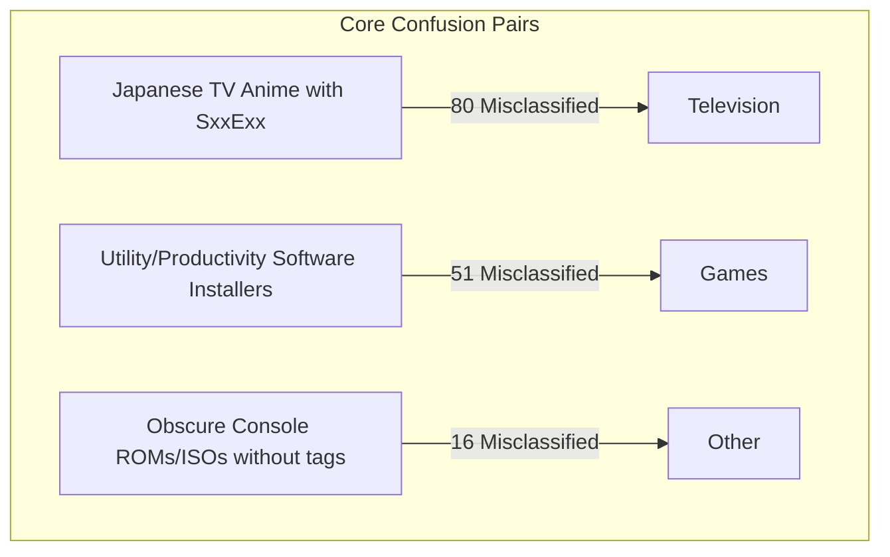

# Classifier Iteration Roadmap & Next Steps Plan

**Status Date:** 2026-08-27  
**Current Model:** `sentence-transformers/all-MiniLM-L12-v2` fine-tuned sequence classifier (8-class)  
**Inference Engine:** Quantized INT8 ONNX Runtime (CPU, ~43 it/s)  

---

## 1. Current Benchmark Performance

### 📊 Balanced Evaluation Benchmark (1,650 Samples)
*Dataset:* `data/manual_eval_set_balanced_2000.jsonl` (Untouched, drawn from 724k PostgreSQL corpus)  
*Overall Accuracy:* **75.7% (1,249 / 1,650)** | *Macro F1:* **`0.712`** | *Weighted F1:* **`0.763`**

| Category | Precision | Recall | F1 Score | Support | Production Status |
|---|---|---|---|---|---|
| **Music** | `0.919` | `0.913` | **`0.916`** | 150 | 🟢 Production Grade |
| **Television** | `0.738` | `0.987` | **`0.845`** | 300 | 🟢 Production Grade |
| **Documentaries** | `0.973` | `0.720` | **`0.828`** | 100 | 🟢 Production Grade |
| **Movies** | `0.861` | `0.767` | **`0.811`** | 300 | 🟢 Production Grade |
| **Other (Junk/Adult)** | `0.761` | `0.835` | **`0.796`** | 400 | 🟢 Production Grade |
| **Games** | `0.561` | `0.740` | **`0.638`** | 100 | 🟡 Good recall, needs precision |
| **Anime** | `0.553` | `0.365` | **`0.440`** | 200 | 🟡 TV overlap to resolve |
| **Applications** | `0.589` | `0.330` | **`0.423`** | 100 | 🟡 Games overlap to resolve |

### 📊 Natural Real-World Test Set (1,000 Samples)
*Dataset:* `data/manual_eval_set_1000.jsonl` (Natural skewed torrent distribution)  
*Accuracy:* **84.9% (849 / 1,000)** | *Other Precision:* **`0.998`** | *TV F1:* **`0.980`** | *Anime Recall:* **`0.903`**

---

## 2. Diagnosis of Remaining Error Clusters

1. **`Anime` $\leftrightarrow$ `Television` (80 confusions on benchmark):**
   - Japanese anime series distributed in standard Western season packs (e.g. `Show Name S01 1080p`) lack fansub bracket tags (`[SubsPlease]`, `[Erai-raws]`) and get categorized as general Television.
   - *Fix:* Targeted active learning on ~250 Japanese franchise titles formatted with Western season/episode tags.

2. **`Applications` $\leftrightarrow$ `Games` (51 confusions on benchmark):**
   - Software utilities packaged with setup/activator/keygen tools share vocabulary with game repacks (e.g., `Setup.exe`, `Crack`, `Patch`, `ISO`).
   - *Fix:* Targeted active learning on ~150 productivity/CAD/dev tool packages (e.g. Adobe, Autodesk, JetBrains, DAWs, plugins).

3. **`Games` $\leftrightarrow$ `Other` (16 confusions on benchmark):**
   - Console game packages (`.nsp`, `.xci`, `.cia`, `.vpk`) without "repack" keywords.
   - *Fix:* Ensure console ROM extensions and emulator release terms are explicitly recognized.

---

## 3. Step-by-Step Execution Plan

### Step 1: Targeted Active Learning on Weak Classes
1. Query PostgreSQL for ~500 items targeting:
   - Japanese anime with `S\d{1,2}` season tags $\to$ Label as `Anime`.
   - Software packages with productivity keywords $\to$ Label as `Applications`.
   - Indie games and console ROMs $\to$ Label as `Games`.
2. Label these items using semantic domain reasoning and add them as true labels (`sample_weight = 1.0`).

### Step 2: Fresh Recalibrated Pseudo-Label Generation
1. Extract a fresh **50,000-sample pool** from PostgreSQL (strictly deduplicated against all training/eval hashes).
2. Run ONNX inference with the current improved model and updated `text_builder.py`.
3. Filter high-confidence predictions using per-class calibrated thresholds (`sample_weight = 0.35–0.40`), emphasizing `Anime`, `Games`, and `Applications`.

### Step 3: Model Retraining & Evaluation
1. Merge the combined dataset (~18,000 samples: ~6,000 true @ 1.0 + ~12,000 pseudo @ 0.40).
2. Retrain on PyTorch with sample-weighted loss and 100% true-label validation partitioning.
3. Quantize to INT8 ONNX and evaluate on both benchmarks:
   - Target: **`Macro F1 >= 0.78 - 0.80`** on balanced benchmark (`data/manual_eval_set_balanced_2000.jsonl`).
   - Target: **`Validation Macro F1 >= 0.80`** on true validation split.

---

## 4. Production Deployment Guidelines

The current INT8 ONNX model at `data/models/transformer/single_stage/model_int8.onnx` is production-ready for immediate integration:

- **Filtering Policy:**
  - `Other` precision is **`0.998`** (99.8% safe to filter out junk/adult torrents by default without swallowing legitimate content).
  - Safe category filters for `Television`, `Movies`, `Music`, and `Documentaries` (all $\ge 0.81$ F1).
- **Inference Integration:**
  - CPU throughput: **~43 items/sec** (under 25ms per item).
  - Can run as a background batch worker in the crawler/indexer pipeline.
