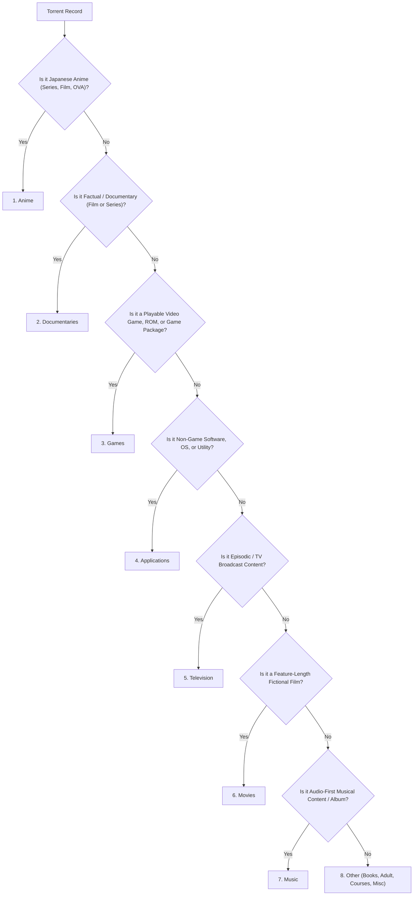

# Torrent Classifier Annotation Guide

## 1. Purpose
This document defines the authoritative taxonomy, operational inclusion/exclusion criteria, decision precedence, and quality-control standards for human labeling of BitTorrent metadata. The resulting labels will serve as the **Gold Standard Benchmark** for evaluating and fine-tuning Gaia’s torrent classifier.

---

## 2. Annotation Principles
1. **Ground Truth by Content, Not Heuristics**: Assign labels based on the primary underlying digital content represented by the torrent, never on regex shortcuts or unverified file extensions.
2. **Frozen Eight-Class Taxonomy**: Every item must be assigned to exactly one of the eight frozen classes: `Anime`, `Applications`, `Documentaries`, `Games`, `Movies`, `Music`, `Other`, `Television`.
3. **Decoupled Uncertainty**: Uncertainty or ambiguity must never be mapped into a custom label (e.g., `Unknown`, `Porn`, or `Uncertain`). Uncertainty is captured via `reviewer_confidence`, `ambiguous`, `alternate_category`, and `reason`.
4. **Blind Independence**: Reviewers must evaluate items independently without access to historical heuristic labels, model predictions, or peer annotations.

---

## 3. Information Available to Reviewers
Human reviewers are provided with blind records (`gold_pilot_blind.jsonl`) containing only inference-legitimate metadata:
* **`pilot_id`**: Opaque tracking identifier (e.g., `GP1-A1B2C3D4E5F67890`).
* **`name`**: Raw release name / torrent title.
* **`file_count`**: Number of files in the payload.
* **`total_size_bytes`**: Total payload size in bytes.
* **`files`**: Top directory hierarchy and representative file paths.
* **`extension_summary`**: Direct file extension breakdown.
* **`metadata_completeness`**: Structural completeness indicator.

*Prohibited Context*: Infohashes, model predictions, source dataset names, and historical evaluation labels are strictly withheld.

---

## 4. Class Definitions

### 4.1 Anime
* **Definition**: Animated productions conventionally distributed, produced, or cataloged as Japanese anime.
* **Inclusions**: Japanese anime TV series, anime feature films, OVAs (Original Video Animation), ONAs (Original Net Animation), anime season packs, Western-formatted anime releases (e.g., `S01E01`), fansubbed and raw anime releases (`[SubsPlease]`, `[Erai-raws]`, `[GJM]`).
* **Exclusions**: Western animated series (e.g., *The Simpsons*, *Amphibia*, *South Park* → `Television`), Western animated movies (e.g., *Toy Story*, *Shrek* → `Movies`), manga and light novels (`.cbz`, `.epub` → `Other`), adult hentai doujinshi (`Other`).
* **Rule**: Anime feature films are classified as **`Anime`**, NOT `Movies`.

### 4.2 Applications
* **Definition**: Non-game software, operating systems, and computer utilities.
* **Inclusions**: Desktop applications, mobile apps (`.apk`, `.ipa`), operating system images (Windows ISOs, macOS installers, Linux distros), productivity software (Office, Photoshop), development tools, database tools, system utilities, drivers, firmware tools, browser extensions.
* **Exclusions**: Playable video games (`Games`), game modifications or DLC packages (`Games`), standalone game emulators with bundled ROMs (`Games`).
* **Rule**: Keygens, cracks, installers (`setup.exe`), and ISO formats do not make a package a Game unless game content is present.

### 4.3 Documentaries
* **Definition**: Non-fictional, factual documentary films, docuseries, or informational educational video productions.
* **Inclusions**: Feature-length documentary films, serialized factual series (BBC, PBS, National Geographic, NOVA, Discovery), historical overviews, nature documentaries, investigative journalism specials.
* **Exclusions**: Fictionalized docudramas (`Movies` or `Television`), reality TV competitions (`Television`), recorded university lectures or tutorials (`Other`), audiobooks/podcasts (`Other`).
* **Precedence**: When clearly factual and documentary in nature, **`Documentaries` takes precedence over `Movies` and `Television`**.

### 4.4 Games
* **Definition**: Interactive, playable digital games, ROMs, game expansions, and game-specific distribution packages.
* **Inclusions**: PC games, console games (PlayStation, Xbox, Nintendo Switch), handheld ROMs (GBA, NDS, PSP), game ISOs/NSX/XCI/VPK/CIA, game repacks (FitGirl, DODI), game updates, DLCs, game-specific crack fixes.
* **Exclusions**: General-purpose console emulators without game ROMs (`Applications`), game soundtrack albums (`Music`), gaming guides and artbooks (`Other`), gaming live streams/VODs (`Other`).

### 4.5 Movies
* **Definition**: Feature-length, non-anime fictional films and cinematic motion pictures.
* **Inclusions**: Theatrical releases, direct-to-streaming fictional feature films, TV movies, short films.
* **Exclusions**: Japanese anime movies (`Anime`), documentary films (`Documentaries`), television series and serial episodes (`Television`), adult pornography films (`Other`).

### 4.6 Music
* **Definition**: Audio-first musical recordings and music-centric releases.
* **Inclusions**: Studio albums, singles, EPs, discographies, live concert audio, official soundtracks (OSTs), vinyl rips, lossless audio packages (FLAC, ALAC, WAV, APE, 320kbps MP3), music video collections.
* **Exclusions**: Audiobooks and spoken-word books (`Other`), comedy stand-up audio (`Other`), podcasts and radio shows (`Other`), audio plugins and DAW software (`Applications`).

### 4.7 Other
* **Definition**: Content that does not fall into the seven specific media/software classes above.
* **Inclusions**: E-books (`.epub`, `.pdf`, `.mobi`), comic books and manga (`.cbr`, `.cbz`), audiobooks and podcasts, online courses and tutorial videos, fonts, stock photos, 3D models and CAD assets, adult pornography (video, images, games, doujinshi), database dumps, corrupted or unidentifiable archives.
* **Constraint**: `Other` must NOT be used merely because the reviewer is unsure; use uncertainty fields for ambiguous cases.

### 4.8 Television
* **Definition**: Episodic, non-anime episodic video content produced for television, cable, or streaming broadcast.
* **Inclusions**: Scripted live-action drama and comedy series, Western animated TV series (*The Simpsons*, *Rick and Morty*), reality television, talk shows (*Jimmy Fallon*, *John Oliver*), documentary-style reality entertainment, miniseries, awards ceremonies, sports broadcasts.
* **Exclusions**: Japanese anime television series (`Anime`), documentary series with strictly educational/factual content (`Documentaries`), theatrical films broadcast on TV (`Movies`).

---

## 5. Decision Order
When a record exhibits characteristics of multiple classes, resolve using this deterministic decision precedence:



---

## 6. Mixed-Content Policy
* **Dominant Payload Rule**: Classify by the primary intended content, ignoring ancillary or bonus files.
  * *Movie + Subtitles + Cover Art + Sample Clip* $\to$ **`Movies`**
  * *Game + Crack + Direct-X Installer + Soundtrack Sample* $\to$ **`Games`**
  * *Application + Keygen + Video Tutorial* $\to$ **`Applications`**
  * *Anime Episode + Clean OP/ED MP3 + Subtitles* $\to$ **`Anime`**
* **Equal / Indivisible Mixed Bundles**: If a torrent contains a heterogeneous mixture with no clear majority (e.g., 50% application software and 50% game ROMs), assign **`Other`**, set `ambiguous: true`, specify `alternate_category`, and document the rationale in `reason`.

---

## 7. Anime vs Television
* **Rule**: Origin and distribution style dictate classification.
* **Japanese Anime Releases**: Titles with fansub release groups (`[SubsPlease]`, `[Erai-raws]`, `[GJM]`), Japanese voice tracks, or cataloged anime franchises (e.g., *One Piece*, *Jujutsu Kaisen*, *Naruto*) are **`Anime`**, even if named using Western episodic formatting (`S02E05`).
* **Western Animation**: Animated productions from Western studios (e.g., Disney, Cartoon Network, Nickelodeon, Netflix Western animation like *Castlevania* or *Arcane*) are classified as **`Television`** (or **`Movies`** if feature films).

---

## 8. Applications vs Games
* **Rule**: Executable installers (`setup.exe`, `.iso`, `.dmg`) are classified by payload function:
  * Office suite, CAD software, IDE, OS installer $\to$ **`Applications`**.
  * AAA game release, indie title, emulated ROM pack, cracked game executable $\to$ **`Games`**.
* **Emulators**: Standalone emulator executables (e.g., RPCS3, Dolphin, Yuzu) are **`Applications`** unless bundled primarily with game ROM sets (in which case the package is **`Games`**).

---

## 9. Movies vs Documentaries
* **Rule**: Factual premise vs dramatized fiction:
  * Nature expeditions (BBC *Planet Earth*), historical investigations, biographical exposés $\to$ **`Documentaries`**.
  * Fictional films, biopics with dramatized actors (e.g., *Oppenheimer*), scripted historical dramas $\to$ **`Movies`**.

---

## 10. Music vs Other
* **Rule**: Audio format and intent:
  * Musical albums, singles, vinyl rips, instrumental OSTs $\to$ **`Music`**.
  * Spoken audiobooks (`.m4b`, `.mp3`), podcasts, recorded lectures, language learning tapes $\to$ **`Other`**.

---

## 11. Other Category Policy
`Other` is a legitimate destination for valid non-media content and miscellaneous payloads. Reviewers must assign `Other` for:
1. Adult / pornographic videos, magazines, games, and doujinshi.
2. Books, comic books, manga scans, magazines, sheet music.
3. Educational video courses (Coursera, Udemy, Pluralsight).
4. System backups, raw dataset archives, junk logs.
5. Incomplete, corrupt, or incomprehensible payloads.

---

## 12. Ambiguous Records
When a record has sparse metadata or genuine boundary ambiguity:
1. Assign the most probable `label_category`.
2. Set `"ambiguous": true`.
3. Select an `"alternate_category"` from the 8 classes (cannot equal primary class).
4. Provide an explanatory string in `"reason"`.
5. Set `"adjudication_required": true`.

---

## 13. Reviewer Confidence
* **`high`**: Unambiguous release title, verified franchise, clear file extension/payload.
* **`medium`**: Probable category based on title signals, but missing file list or has non-standard naming.
* **`low`**: Highly obfuscated title, truncated text, or conflicting indicators. **Requires `"reason"` field.**

---

## 14. Adjudication Rules
An item is automatically queued for secondary adjudication if:
1. Reviewer A and Reviewer B assign different `label_category` values.
2. Either reviewer marks `"reviewer_confidence": "low"`.
3. Either reviewer marks `"ambiguous": true`.
4. Either reviewer sets `"adjudication_required": true`.

---

## 15. Examples

| Raw Torrent Name | Payload Clues | Correct Label | Confidence | Ambiguous | Rationale |
|---|---|---|---|---|---|
| `[Erai-raws] One Piece - 1143 [1080p].mkv` | `.mkv` (1.4 GB) | **`Anime`** | `high` | `false` | Japanese anime series release with fansub tag. |
| `The.Mentalist.S02E10.1080p.WEB.H264.mkv` | `.mkv` (2.1 GB) | **`Television`** | `high` | `false` | Scripted live-action episodic television. |
| `Oppenheimer.2023.2160p.UHD.Remux.mkv` | `.mkv` (68 GB) | **`Movies`** | `high` | `false` | Theatrical fictional feature film. |
| `BBC.Frozen.Planet.II.S01E01.1080p.mkv` | `.mkv` (3.4 GB) | **`Documentaries`** | `high` | `false` | Factual nature documentary series. |
| `Adobe.Photoshop.2026.v27.0.Multilingual.zip` | `setup.exe` (4.2 GB) | **`Applications`** | `high` | `false` | Desktop creative utility application. |
| `Cyberpunk.2077.Phantom.Liberty-RUNE.iso` | `.iso` (72 GB) | **`Games`** | `high` | `false` | Playable PC game release with scene tag. |
| `Hans.Zimmer.Interstellar.OST.FLAC.Lossless` | `.flac`, `.cue` (650 MB) | **`Music`** | `high` | `false` | Lossless audio soundtrack release. |
| `Learn.Rust.Zero.To.Mastery.2026.Tutorial.rar` | `.mp4`, `.pdf` (8.5 GB) | **`Other`** | `high` | `false` | Educational online programming course. |
| `Eva.Elfies.Wild.Adventure.1080p.mp4` | `.mp4` (1.8 GB) | **`Other`** | `high` | `false` | Adult pornography release. |
| `Attack.on.Titan.Chronicle.2020.1080p.mkv` | `.mkv` (4.5 GB) | **`Anime`** | `high` | `false` | Anime compilation movie (Anime takes precedence over Movies). |

---

## 16. Prohibited Annotation Signals
Reviewers must NEVER base decisions on:
1. Regex pattern matches or previous script logic.
2. Speculation regarding private tracker rules or upload ratios.
3. Automated web-scraper heuristics.
4. Model prediction logits or pseudo-label confidence.

---

## 17. Quality-Control Checklist
Before submitting an annotation file:
- [ ] Every record has a valid `pilot_id` matching `gold_pilot_manifest.json`.
- [ ] No duplicate `pilot_id` entries exist.
- [ ] Every `label_category` belongs to the 8 frozen classes.
- [ ] Every low-confidence or ambiguous record has a non-empty `reason`.
- [ ] Timestamps are formatted as valid ISO 8601 strings.
- [ ] No prohibited fields (infohashes, model scores, source labels) are present.
- [ ] The file passes validation via `python3 apps/classifier/tools/validate_gold_annotations.py <file>`.

---

## 18. Reviewer Package & Setup Commands

Each reviewer receives:
1. `apps/classifier/data/gold_pilot/gold_pilot_blind.jsonl` (Read-only metadata reference)
2. A separate working copy of `apps/classifier/data/gold_pilot/gold_pilot_review_template.jsonl`

### Setup Commands for Reviewers:
```bash
# Setup working template for Reviewer A
cp apps/classifier/data/gold_pilot/gold_pilot_review_template.jsonl \
   reviewer_a_annotations.jsonl

# Setup working template for Reviewer B
cp apps/classifier/data/gold_pilot/gold_pilot_review_template.jsonl \
   reviewer_b_annotations.jsonl
```
