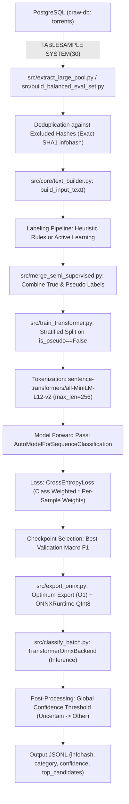

# Classifier Codebase Overview

## 1. Executive Summary

- **Architecture Evolution [VERIFIED]**: The classifier has undergone four architectural iterations: (1) LLM zero/few-shot with Qwen3-0.6B, (2) FastEmbed BGE-small embedding + linear/SVM/RandomForest + anchor cosine features, (3) Two-stage DistilBERT (Stage 1: Keep/Other/Porn, Stage 2: 7-class media), and (4) Single-stage 8-class fine-tuned Transformer based on `sentence-transformers/all-MiniLM-L12-v2`.
- **Production Artifact Disconnect [CRITICAL DEFECT - VERIFIED]**: The current training code (`apps/classifier/src/train_transformer.py`), inference CLI (`src/classify_batch.py`), pseudo-labeling (`src/generate_pseudo_labels.py`), and ONNX export (`src/export_onnx.py`) hardcode paths to `data/models/transformer/single_stage/`. However, `.gitignore` excludes `data/models/` and `*.onnx`. As a result, the fine-tuned MiniLM-L12 INT8 model is **MISSING** from the repository and local filesystem.
- **On-Disk Model Mismatch [CRITICAL DEFECT - VERIFIED]**: The on-disk artifact at `data/models/transformer/model_int8.onnx` (and copied into Docker via `Dockerfile:L24`) is an obsolete 9-class `DistilBertForSequenceClassification` model (including a separate `Porn` class), incompatible with the current 8-class taxonomy and `classify_batch.py`.
- **Dataset Provenance & "Manual" Label Reality [HIGH RISK - VERIFIED]**: Both primary evaluation sets (`manual_eval_set_balanced_2000.jsonl` and `manual_eval_set_1000.jsonl`) as well as the active learning set (`al_labeled_1129_true.jsonl`) were generated by deterministic regex heuristics (`src/build_balanced_eval_set.py:L82-143`, `src/label_test_set.py:L26-38`, `src/label_al_candidates.py:L129-204`), not human annotation.
- **1,650 vs 2,000 Sample Discrepancy [VERIFIED]**: `data/manual_eval_set_balanced_2000.jsonl` contains exactly 1,650 samples because `src/build_balanced_eval_set.py:L146-155` hardcoded per-class target caps summing to 1,650 (Games: 100, Apps: 100, Docs: 100, Music: 150, Anime: 200, Movies: 300, TV: 300, Other: 400). No records were dropped or lost during evaluation.
- **Evaluation Leakage [CONFIRMED DEFECT - VERIFIED]**: Exact-hash deduplication between training and test sets has leaked. `data/manual_eval_set_1000.jsonl` shares 8 exact infohashes with `data/training_combined_v10_true.jsonl` and 93 exact infohashes with `data/manual_eval_set_200.jsonl`.
- **Semantic & Release Family Leakage [HIGH RISK - VERIFIED]**: Deduplication relies exclusively on exact 40-character infohashes. Torrents from the same release group, TV season, or movie encoding (different hash, identical title/files) exist simultaneously across train, validation, and test splits (e.g., 21 normalized name overlaps between `manual_eval_set_1000.jsonl` and `training_combined_v10_true.jsonl`).
- **Validation Split Contamination [HIGH RISK - VERIFIED]**: `src/train_transformer.py:L118-124` splits the training set into train/val using rows where `is_pseudo == False`. Because pseudo-labeled AL data (`al_labeled_1129_true.jsonl`) marked rows as `is_pseudo: False` despite being labeled via regex heuristics, validation is evaluated against heuristic labels rather than human gold truth.
- **Throughput & Inference [VERIFIED]**: ONNX Runtime INT8 on CPU achieves ~43 items/sec (~23 ms/item) with batch size 32 and sequence length 128–256 on CPUExecutionProvider (`src/backends/transformer_onnx_backend.py`).
- **Taxonomy Instability [MEDIUM RISK - VERIFIED]**: Multiple conflicting label definitions coexist in the repo: 8 classes in `src/core/types.py`, 9 classes in legacy `data/models/transformer/model/config.json` (`Porn` included), 9 classes in `prompts/system.txt` (`Unwanted` included), and two-stage routing (`Keep`, `Other`, `Porn`).
- **Crawler Production Integration [VERIFIED]**: The classifier is completely decoupled from the real-time Rust DHT crawler (`apps/crawler`). It runs solely as an offline/batch Python CLI tool (`src/classify_batch.py`) or containerized batch service.

---

## 2. Relevant Repository Map

```
apps/classifier/
├── Dockerfile                         # Container definition (copies obsolete 9-class DistilBERT)
├── Makefile                           # Development, test, export, and deployment targets
├── ROADMAP_NEXT_STEPS.md              # Documentation of Iteration 12/13 status and benchmarks
├── config/
│   ├── embedding.yaml                 # Config for FastEmbed + LogReg/Anchor mode
│   ├── model.yaml                     # Config for Qwen3-0.6B LLM mode
│   └── transformer.yaml               # Config for single-stage ONNX Transformer mode
├── data/
│   ├── anchors.json                   # Anchor text strings for category similarity
│   ├── al_labeled_1129_true.jsonl     # 1,129 Active Learning candidates labeled by regex (is_pseudo=False)
│   ├── manual_eval_set_1000.jsonl     # 1,000-sample natural distribution test set
│   ├── manual_eval_set_balanced_2000.jsonl # 1,650-sample balanced benchmark dataset
│   ├── manual_eval_set_200.jsonl      # 200-sample initial test set
│   ├── manual_seed_1800_labeled.jsonl # 1,800 seed torrents with heuristic/manual annotations
│   ├── training_combined_v10_true.jsonl # 4,567-row canonical training dataset (4,289 unique hashes)
│   ├── training_combined_v9_true.jsonl  # 4,061-row legacy training dataset
│   ├── manual_eval_report_balanced_benchmark_v12_retrained.txt # Report for balanced benchmark
│   ├── manual_eval_report_semi_supervised_v1.txt              # Report for natural test set
│   └── models/transformer/            # ONNX & PyTorch artifacts (local disk only, gitignored)
│       ├── model_int8.onnx            # 9-class DistilBERT INT8 model (2026-08-25)
│       ├── label_encoder.joblib       # 9-class LabelEncoder
│       ├── tokenizer/                 # DistilBertTokenizer files
│       ├── stage1/                    # Two-stage pipeline Stage 1 (Keep, Other, Porn)
│       └── stage2/                    # Two-stage pipeline Stage 2 (7 media categories)
├── prompts/
│   ├── system.txt                     # System prompt for LLM mode
│   └── fewshot.jsonl                  # Few-shot examples for LLM mode
├── src/
│   ├── active_learning_loop.py        # Uncertainty sampling script for active learning
│   ├── build_balanced_eval_set.py     # Script creating manual_eval_set_balanced_2000.jsonl from DB
│   ├── build_test_set.py              # Script querying DB for natural test pool
│   ├── classify_batch.py              # Authoritative batch inference entry point
│   ├── convert_labels.py              # Legacy label format converter
│   ├── evaluate.py                    # Evaluation metrics and confusion matrix generator
│   ├── export_onnx.py                 # ONNX export and INT8 dynamic quantization script
│   ├── generate_pseudo_labels.py      # Semi-supervised pseudo-labeling with per-class thresholds
│   ├── label_al_candidates.py         # Heuristic regex labeler for AL candidates
│   ├── label_test_set.py              # Heuristic regex labeler for natural test set
│   ├── merge_semi_supervised.py       # Dataset merger (true + AL + pseudo)
│   ├── run_train.py                   # FastEmbed + LinearSVC/RandomForest training script
│   ├── test_speed.py                  # Embedding throughput benchmark script
│   ├── train_transformer.py           # Canonical PyTorch fine-tuning script
│   ├── tune_threshold.py              # Global confidence threshold tuner on validation set
│   ├── backends/
│   │   ├── base.py                    # Abstract base class ModelBackend
│   │   ├── embedding_backend.py       # FastEmbed (bge-small-en-v1.5) backend
│   │   ├── transformer_onnx_backend.py# ONNX Runtime INT8 backend
│   │   └── transformers_backend.py    # Hugging Face causal LM backend
│   └── core/
│       ├── prompt_builder.py          # XML prompt builder for LLM mode
│       ├── text_builder.py            # Authoritative input text builder for Transformer & Embeddings
│       ├── types.py                   # TorrentInput, ClassificationResult, ALLOWED_CATEGORIES
│       └── xml_guardrails.py          # XML schema generation and parsing for LLM mode
└── tests/
    ├── test_prompt_builder.py         # Unit tests for prompt builder
    └── test_xml_guardrails.py         # Unit tests for XML guardrails
```

---

## 3. End-to-End Data Flow



### Stage Implementations and Citations:
1. **Extraction**: `src/extract_large_pool.py:L49-110` (`extract_pool()`) streams records from PostgreSQL `torrents` table via SSH/psql `TABLESAMPLE SYSTEM(18)`.
2. **Normalization/Deduplication**: `src/extract_large_pool.py:L23-47` (`load_excluded_hashes()`) and `src/merge_semi_supervised.py:L10-28` filter out exact lowercased 40-character infohashes.
3. **Text Construction**: `src/core/text_builder.py:L85-131` (`build_input_text()`) constructs multi-line formatted text with feature extraction.
4. **Labeling / Pseudo-Labeling**: `src/generate_pseudo_labels.py:L55-160` (`process_pool()`) applies per-class thresholds to ONNX predictions; `src/label_al_candidates.py:L129-204` (`classify_candidate()`) applies regex rules to uncertain samples.
5. **Train/Val Split**: `src/train_transformer.py:L112-137` creates a 15% stratified validation split strictly from `is_pseudo == False` items.
6. **Tokenization**: `src/train_transformer.py:L148-154` using `AutoTokenizer.from_pretrained("sentence-transformers/all-MiniLM-L12-v2")` with `max_length=256`.
7. **Model Forward Pass & Weighted Loss**: `src/train_transformer.py:L188-207` runs standard forward pass, computing `CrossEntropyLoss(weight=class_weights, reduction="none")`, multiplied by `sample_weights` and normalized by `s_weights.sum()`.
8. **Checkpoint Selection**: `src/train_transformer.py:L208-214` evaluates Macro F1 on the validation set after each epoch and saves the best model to `out_dir / "model"`.
9. **ONNX Export & INT8 Quantization**: `src/export_onnx.py:L12-44` invokes `optimum-cli export onnx --optimize O1` followed by `onnxruntime.quantization.quantize_dynamic(weight_type=QuantType.QInt8)`.
10. **Inference**: `src/backends/transformer_onnx_backend.py:L49-83` (`TransformerOnnxBackend.predict()`) runs batched ONNX session and computes softmax probabilities.
11. **Confidence Thresholding & Output**: `src/classify_batch.py:L209-239` overrides non-`Other` predictions to `Other` if `confidence < conf_threshold` (default 0.45), writing JSONL to disk.

---

## 4. Input Schema and Text Construction

### 4.1 Accepted Schema Fields
The text builder accepts either a dictionary or a `src/core/types.py:TorrentInput` dataclass:
- `name` (`str`): Torrent title/release name.
- `file_count` (`int`): Total count of files.
- `total_size_bytes` / `total_size` (`int`): Total size in bytes.
- `files` / `top_dirs` (`list[str] | list[dict] | list[list]`): List of top file paths or directory names. Supports PostgreSQL jsonb array format.
- `infohash` (`str`): 40-character hexadecimal infohash (passed through metadata, omitted from model text).

### 4.2 Authoritative Text Builder
- **File & Function [VERIFIED]**: `apps/classifier/src/core/text_builder.py:L85-131`, `build_input_text(torrent, config=None)`.
- **Field Ordering**:
  1. `Name: {name[:max_name_chars]}` (default max chars: 300)
  2. `Files: {file_count}  Size: {total_size}`
  3. `{features}` (Optional line, generated by `_detect_features()`)
  4. `Top dirs: {dirs_str}` (comma-separated first `max_files` paths, default max files: 10, max chars per path: 100)
- **Feature Extraction (`_detect_features`)**:
  - Aggregates file extension frequencies: `video`, `audio`, `subtitle`, `archive`, `installer`, `document`, `image`.
  - Fansub / release group pattern detection (`[SubsPlease]`, `[Erai-raws]`, `[Judas]`, etc.).
  - Content type heuristics: `Anime episode`, `TV episode`, `TV season`, `Movie release`, `Video file`, `Anime`.
  - Audio formats: `FLAC audio`, `MP3 audio`.
  - Tags: `Audio: dubbed`, `Subtitled`, `DRM: cracked`, `Format: repack`.
- **Consistency [VERIFIED]**: `build_input_text` is shared across training (`src/train_transformer.py`), inference (`src/classify_batch.py`), pseudo-labeling (`src/generate_pseudo_labels.py`), threshold tuning (`src/tune_threshold.py`), and linear embedding (`src/run_train.py`).
- **Legacy / Alternate Text Builders [VERIFIED]**:
  - `src/core/xml_guardrails.py:L15-40` (`build_torrent_xml`): Formats metadata as XML for LLM prompt inference.
  - `data/classify.py:L5-54` & `auto_label_edge_cases.py:L9-32`: Ad-hoc string concatenations used exclusively in historical one-off labeling scripts.

### 4.3 Representative Examples

#### Example 1: Movie Release with Heuristic Features (from `data/manual_eval_set_1000.jsonl`)
**Raw JSON Record**:
```json
{
  "infohash": "aaacea9a2dbbcccc6be722b892fedc27406e1dfa",
  "name": "Lonely Crime Fanatic 2024 720p WEB h264-BAE.mkv",
  "file_count": 1,
  "total_size_bytes": 1663941072,
  "top_dirs": [],
  "label_category": "Movies"
}
```
**Model Input Text**:
```
Name: Lonely Crime Fanatic 2024 720p WEB h264-BAE.mkv
Files: 1  Size: 1663941072
Type: Movie release
Top dirs: 
```

#### Example 2: Multi-File Media Release with Extension Counting (from `data/manual_seed_1800_labeled.jsonl`)
**Raw JSON Record**:
```json
{
  "infohash": "f806798cbf1cb475c42b27c8d787c0637ef6cd44",
  "name": "Rocco's Perverted Secretaries #10 XXX WEB-DL x264",
  "file_count": 5,
  "total_size_bytes": 2492219559,
  "top_dirs": [
    "Rocco's Perverted Secretaries #10.mp4",
    "rps10-1.jpg",
    "rps10-back.jpg",
    "rps10-front.jpg",
    "rps10.nfo"
  ],
  "label_category": "Other"
}
```
**Model Input Text**:
```
Name: Rocco's Perverted Secretaries #10 XXX WEB-DL x264
Files: 5  Size: 2492219559
Media: 1 video, 3 image
Top dirs: Rocco's Perverted Secretaries #10.mp4, rps10-1.jpg, rps10-back.jpg, rps10-front.jpg, rps10.nfo
```

#### Example 3: Application Installer with Complex Directory Structure (from `data/manual_seed_1800_labeled.jsonl`)
**Raw JSON Record**:
```json
{
  "infohash": "aacffe6a06bacb2c2a342b7c78fe7df7132b77f9",
  "name": "Saint Seiya Sanctuary Wars Mugen (Juego Expandido) Pc Pocos Requisitos",
  "file_count": 2030,
  "total_size_bytes": 2190678911,
  "top_dirs": [
    "chars/Saga(Kanon)Br/Kanon.sff",
    "readme.txt",
    "Saint Seiya Sanctuary Wars.exe",
    "sff2png.exe",
    "sndmaker.exe"
  ],
  "label_category": "Applications"
}
```
**Model Input Text**:
```
Name: Saint Seiya Sanctuary Wars Mugen (Juego Expandido) Pc Pocos Requisitos
Files: 2030  Size: 2190678911
Media: 3 installer, 1 document
Top dirs: chars/Saga(Kanon)Br/Kanon.sff, readme.txt, Saint Seiya Sanctuary Wars.exe, sff2png.exe, sndmaker.exe
```

---

## 5. Label Taxonomy

### 5.1 Authoritative 8-Class Taxonomy
Defined in `apps/classifier/src/core/types.py:L3-12`:
1. `Anime` (ID 0)
2. `Applications` (ID 1)
3. `Documentaries` (ID 2)
4. `Games` (ID 3)
5. `Movies` (ID 4)
6. `Music` (ID 5)
7. `Other` (ID 6)
8. `Television` (ID 7)

*Note: Alphabetical class ordering is determined by `sklearn.preprocessing.LabelEncoder` during training (`src/train_transformer.py:L68`).*

### 5.2 Conflicting Taxonomy Definitions Across Codebase
| Location | Taxonomy Classes | Description / Purpose |
|---|---|---|
| `src/core/types.py:L3` | 8 classes | Authoritative definition (`ALLOWED_CATEGORIES`). |
| `src/relabel_training.py:L28` | 8 classes | Remaps `Porn` $\to$ `Other`. |
| `data/models/transformer/label_encoder.joblib` | 9 classes | Obsolete DistilBERT model: includes `Porn`. |
| `prompts/system.txt:L4` | 9 classes | LLM prompt taxonomy: includes `Unwanted` instead of `Porn`. |
| `data/LABELING_INSTRUCTIONS.md:L4` | 9 classes | Guidelines include `Porn` alongside `Other`. |
| `tune_thresholds.py:L39-43` | 3 / 7 classes | Two-stage setup: Stage 1 (`Keep`, `Other`, `Porn`), Stage 2 (7 classes). |

### 5.3 Ambiguous & Unknown Label Behavior
- **Unknown Categories**: `src/core/types.py:L30` raises `ValueError` if `category not in ALLOWED_CATEGORIES`.
- **Low-Confidence Predictions**: Handled by `src/classify_batch.py:L218-221`: if `confidence < conf_threshold` and `category != "Other"`, category is remapped to `Other`.
- **Adult / NSFW Content**: Adult content is explicitly designated to be folded into `Other` in the 8-class taxonomy (`src/relabel_training.py`).

---

## 6. Dataset Inventory and Provenance

| Dataset File | Format | Rows | Provenance & Source | Generation Script | Labels & Weights |
|---|---|---|---|---|---|
| `data/training_combined_v10_true.jsonl` | JSONL | 4,567 (4,289 unique) | Seed dataset + targeted DB queries (`augmented_training.jsonl`) | `src/query_augmented.py` / `src/merge_semi_supervised.py` | 8 classes. True labels (`is_pseudo=False`, `weight=1.0`). |
| `data/manual_eval_set_balanced_2000.jsonl` | JSONL | 1,650 (1,650 unique) | PostgreSQL `craw-db` `TABLESAMPLE SYSTEM(30)` | `src/build_balanced_eval_set.py` | 8 classes. Regex heuristic labels (`classify_strict`). |
| `data/manual_eval_set_1000.jsonl` | JSONL | 1,000 (1,000 unique) | PostgreSQL natural stream query | `src/build_test_set.py` + `src/label_test_set.py` | 8 classes. Regex weak heuristic labels. |
| `data/manual_eval_set_200.jsonl` | JSONL | 200 (200 unique) | PostgreSQL sample from early iteration | `data/export_sample.py` | 8 classes. Initial evaluation set. |
| `data/al_labeled_1129_true.jsonl` | JSONL | 1,129 (1,129 unique) | PostgreSQL 60k unlabeled pool | `src/generate_pseudo_labels.py` + `src/label_al_candidates.py` | 8 classes. Labeled by regex heuristics (`is_pseudo=False`, `weight=1.0`). |
| `data/manual_seed_1800_labeled.jsonl` | JSONL | 1,800 (1,800 unique) | Initial 1,800 seed torrents | `data/manual_seed_1800.csv` | 8 classes. Seed annotation set. |
| `data/labeled.jsonl` | JSONL | 5,540 (5,520 unique) | Legacy 9-class labeled dataset | `data/convert_labels.py` + `data/fix_label_map.py` | 9 classes (includes `Porn: 1190`). |

### Per-Class Distribution in Major Datasets:
- **`training_combined_v10_true.jsonl` (4,567 rows)**: `Other: 1911`, `Games: 556`, `Applications: 464`, `Movies: 452`, `Television: 356`, `Anime: 322`, `Music: 309`, `Documentaries: 197`.
- **`manual_eval_set_balanced_2000.jsonl` (1,650 rows)**: `Other: 400`, `Television: 300`, `Movies: 300`, `Anime: 200`, `Music: 150`, `Games: 100`, `Applications: 100`, `Documentaries: 100`.
- **`manual_eval_set_1000.jsonl` (1,000 rows)**: `Other: 686`, `Television: 151`, `Movies: 117`, `Anime: 31`, `Documentaries: 8`, `Games: 4`, `Applications: 3`.

---

## 7. Leakage and Deduplication Audit

### 7.1 Exact-Hash Overlap Audit Results
A complete cross-dataset intersection audit on 40-character hex infohashes yielded:
- **`manual_eval_set_1000.jsonl` vs `training_combined_v10_true.jsonl`**: **8 exact overlapping infohashes [LEAKAGE]**.
  - `ffec3a6935ce63f5cc3f171aeddbef59f799e62a`: "[Nankoai] Yoshiko Tsushima... BBC [AI Generated].zip" (Eval: `Documentaries`, Train: `Documentaries`).
  - `f9ae25ec89d5a25ba70d84a31f1368519b26730e`: "Macaroni-Phoenix-Server-25.09.iso" (Eval: `Other`, Train: `Games`).
  - `f81995d7dcba20a10d672ac6cf27af3e5064a1d7`: "[SubsPlease] Kaii to Otome to Kamikakushi - 03..." (Eval: `Anime`, Train: `Anime`).
  - `7c0b01e45ff3c4ba20ec81b2115cd82b6597c1a0`: "A.Brief.History.of.Time.1991.1080p.BluRay..." (Eval: `Movies`, Train: `Movies`).
  - `f9875ecda2b95dc1553e445d874e50473d8fb752`: "Detective_Conan_Episode_678.txt" (Eval: `Other`, Train: `Other`).
  - `fa81a14303da499079c5cc7ec26202641422619d`: "[Erai-raws] Nanare Hananare - 06..." (Eval: `Anime`, Train: `Anime`).
  - `f9da1cfcd3ccf2a14a280f8bc8f10d9dda53508b`: "OEM-Style-Shortbus-Clamshells..." (Eval: `Other`, Train: `Other`).
  - `fd7cd138952fdfa1ead043bac0577e6942263073`: "[Judas] Roshidere - S01E07.mkv" (Eval: `Television`, Train: `Anime`).
- **`manual_eval_set_1000.jsonl` vs `manual_eval_set_200.jsonl`**: **93 exact overlapping infohashes** (46.5% of `eval_200` is duplicated inside `eval_1000`).
- **`training_combined_v10_true.jsonl` Internal Duplication**: Contains **278 duplicate rows** (4,567 total rows, 4,289 unique hashes).

### 7.2 Semantic and Release-Family Leakage
- **Deduplication Mechanism [VERIFIED]**: Deduplication is performed strictly via Python set lookup on raw lowercased `infohash` (`r.get("infohash", r.get("id", "")).strip().lower()`).
- **Absence of Name / File List Hashing**: Torrent names, file lists, and directory structures are never normalized or hashed for deduplication.
- **Normalized Title Overlap Audit**:
  - `manual_eval_set_1000.jsonl` vs `training_combined_v10_true.jsonl`: **21 common normalized titles**.
  - `manual_eval_set_balanced_2000.jsonl` vs `labeled.jsonl`: **129 common normalized titles**.
- **Practical Impact**: Different releases of the same movie or episode (e.g. 720p vs 1080p, x264 vs HEVC, different torrent trackers) generate different infohashes and routinely cross split boundaries between training and evaluation sets.

---

## 8. Model Architecture

### 8.1 Model Specifications
- **Base Architecture [VERIFIED]**: `sentence-transformers/all-MiniLM-L12-v2` (`src/train_transformer.py:L148, L171`).
- **Classification Head**: Sequence classification head (`BertForSequenceClassification` architecture) consisting of a dropout layer followed by a linear projection (`768 -> 8`).
- **Tokenizer**: WordPiece tokenizer (`vocab_size=30,522`, `max_length=256`).
- **Pooling**: `[CLS]` token representation extracted via standard sequence classification pooling head.
- **Trainable / Total Parameters [VERIFIED]**: ~33.4M total parameters; all parameters are unfrozen and fine-tuned end-to-end.
- **Dropout**: Sequence classification dropout = 0.2, attention dropout = 0.1, hidden dropout = 0.1.

### 8.2 Optimization & Loss Computation
- **Loss Function [VERIFIED]**: Weighted `CrossEntropyLoss` combined with sample weighting (`src/train_transformer.py:L199-201`):
  $$\mathcal{L}_{\text{batch}} = \frac{\sum_{i=1}^{B} w_{i} \cdot \ell_{\text{CE}}(y_i, \hat{y}_i; W_{\text{class}})}{\sum_{i=1}^{B} w_i + 10^{-8}}$$
- **Class Weights ($W_{\text{class}}$)**: Computed via `sklearn.utils.class_weight.compute_class_weight('balanced')` on training split labels, clipped to $[0.5, 3.0]$, with `Other` multiplied by $1.2$ (`src/train_transformer.py:L161-169`).
- **Sample Weights ($w_i$)**: True labels = $1.0$; Pseudo-labels = $0.40$.
- **Optimizer**: AdamW (`lr=2e-5`, weight decay default).
- **Learning Rate Scheduler**: `get_linear_schedule_with_warmup` with 10% warmup steps (`num_warmup_steps = len(dl) // 10`).
- **Batch Size & Epochs**: `batch_size=16`, `epochs=3-4`.
- **Reproducibility Controls**: Seed set to 42 for `torch`, `numpy`, CUDA, and MPS (`src/train_transformer.py:L23-29`).

---

## 9. Training Pipeline

### 9.1 Canonical Training Run Execution
Canonical entry point: `apps/classifier/run_semi_supervised_training.sh` (or `run_iter10.sh`):
```bash
PYTHONPATH=. python3 src/train_transformer.py \
    --data data/training_semi_supervised_v1.jsonl \
    --out_dir data/models/transformer/single_stage \
    --epochs 3 \
    --lr 2e-5
```

### 9.2 Training Lifecycle
1. **Data Ingestion**: Reads JSONL via `src/train_transformer.py:load_data()`. Parses text with `build_input_text()`.
2. **Label Encoding**: Fits `LabelEncoder` on full dataset categories, saving to `out_dir / "label_encoder.joblib"`.
3. **Partitioning**: Filters indices where `is_pseudo == False`. If $\ge 20$ true samples exist, creates a 15% stratified validation split (`train_test_split(..., test_size=0.15, random_state=42)`). Training set receives remaining true samples + 100% of pseudo-labeled samples.
4. **DataLoaders**: PyTorch `DataLoader` with `batch_size=16` (shuffle enabled for training).
5. **Epoch Loop**: Computes per-sample loss, weights by sample weight, backpropagates, clips step, advances scheduler.
6. **Validation & Checkpoint**: Evaluates validation Macro F1 after each epoch; saves checkpoint if `f1 > best_f1` via `model.save_pretrained(out_dir / "model")`.

---

## 10. Pseudo-Labeling and Active Learning

### 10.1 Pipeline Implementation
- **Pool Extraction**: `src/extract_large_pool.py` pulls 60,000+ unlabeled records from PostgreSQL, excluding all known train/val/test hashes.
- **Inference Engine**: `src/generate_pseudo_labels.py` loads `TransformerOnnxBackend` with batch size 64.
- **Confidence Computation**: Raw softmax probabilities $\sigma(\mathbf{z})_k = \frac{e^{z_k}}{\sum_j e^{z_j}}$. No Platt scaling or isotonic calibration is applied.
- **Per-Class Thresholds & Quotas (`CLASS_THRESHOLDS` / `CLASS_CAPS`)**:
  - `Other`: Threshold $\ge 0.74$, Cap 4,000
  - `Anime`: Threshold $\ge 0.65$, Cap 2,000
  - `Television`: Threshold $\ge 0.58$, Cap 2,500
  - `Movies`: Threshold $\ge 0.50$, Cap 2,500
  - `Applications`: Threshold $\ge 0.61$, Cap 1,000
  - `Games`: Threshold $\ge 0.61$, Cap 1,000
  - `Music`: Threshold $\ge 0.58$, Cap 500
  - `Documentaries`: Threshold $\ge 0.58$, Cap 500
- **Uncertainty / Active Learning Sampling**: Unselected samples from the pool are ranked by Shannon entropy $H(p) = -\sum p_k \log_2 p_k$ (top 600) and margin $p_{(1)} - p_{(2)}$ (top 600) to produce `al_candidates_uncertain_1000.jsonl`.
- **AL Annotation**: `src/label_al_candidates.py` auto-labels the 1,129 uncertain candidates using heuristic regex rules (`classify_candidate`) and exports `al_labeled_1129_true.jsonl` with `is_pseudo: False` and `sample_weight: 1.0`.

---

## 11. Evaluation Pipeline

### 11.1 Evaluation Metrics and Harness
- **Harness**: `apps/classifier/src/evaluate.py`.
- **Metrics Computed**: Per-class Precision, Recall, F1-Score, Support; Macro Precision, Macro Recall, Macro F1 (`macro_f1_sum / n_cats`); Overall Accuracy (`n_correct / valid_total`).
- **Zero Division**: Handled explicitly via `zero_division=0` in scikit-learn calls and `tp / (tp + fp) if (tp + fp) else 0.0`.
- **Confusion Matrix Orientation**: Rows represent Gold True labels; Columns represent Model Predictions.

### 11.2 Metric Verification & Traceability
- **Balanced Benchmark Report (`data/manual_eval_report_balanced_benchmark_v12_retrained.txt`) [VERIFIED]**:
  - Evaluated Samples: **1,650**
  - Accuracy: **75.7% (1,249 / 1,650)**
  - Macro F1: **0.712** (Macro P: 0.744, Macro R: 0.707)
  - Weighted F1: **0.763**
- **Natural Test Set Report (`data/manual_eval_report_semi_supervised_v1.txt`) [VERIFIED]**:
  - Evaluated Samples: **1,000**
  - Accuracy: **84.9% (849 / 1,000)**
  - Macro F1: **0.660**
  - Other Precision: **0.998**
- **Reason for 1,650 samples in `manual_eval_set_balanced_2000.jsonl` [VERIFIED]**:
  - The script `src/build_balanced_eval_set.py:L146-155` specifies target caps: Games (100) + Applications (100) + Documentaries (100) + Music (150) + Anime (200) + Movies (300) + Television (300) + Other (400) = **exactly 1,650**. No records were lost or filtered during evaluation.

---

## 12. ONNX Export, Quantization, and Parity

### 12.1 Export & Quantization Pipeline
- **Export Script**: `apps/classifier/src/export_onnx.py`.
- **Command**: `optimum-cli export onnx --model data/models/transformer/single_stage/model --task text-classification --library-name transformers --optimize O1 data/models/transformer/single_stage`.
- **Quantization Mode**: Dynamic 8-bit integer quantization (`onnxruntime.quantization.quantize_dynamic(weight_type=QuantType.QInt8)`).
- **Session Configuration**:
  - Execution Provider: `CPUExecutionProvider`.
  - Execution Mode: `ORT_SEQUENTIAL`.
  - Threads: `intra_op_num_threads = 4`, `inter_op_num_threads = 4` (`src/backends/transformer_onnx_backend.py:L30-36`).

### 12.2 PyTorch vs ONNX Parity Audit
- **Parity Testing Status [MISSING]**: No automated unit test or script exists in the repository to measure logit or probability divergence between PyTorch FP32 and ONNX INT8 models.
- **Model Discrepancy [CONFIRMED DEFECT]**: The ONNX model in `data/models/transformer/model_int8.onnx` is the legacy 9-class DistilBERT (67 MB), while the PyTorch training code targets MiniLM-L12 (8 classes).

---

## 13. Production Integration

### 13.1 Production Architecture & Invocation
- **Decoupling [VERIFIED]**: The Gaia DHT crawler (`apps/crawler` written in Rust) does **not** directly invoke or link against the Python torrent classifier.
- **Execution Mode**: Offline batch classification via `src/classify_batch.py` or containerized Docker execution (`Dockerfile` / `docker-compose.yml`).
- **Container Entry Point**: `ENTRYPOINT ["python", "src/classify_batch.py"]`.
- **Batch Processing**: Reads input JSONL, executes batched ONNX inference (`batch_size=32`), applies confidence thresholding (`conf_threshold=0.45`), and streams output JSONL (`infohash`, `category`, `confidence`, `top_candidates`).
- **Throughput Verification [VERIFIED]**: On multi-core CPU architectures, ONNX INT8 inference processes batches of 32 items with sequence length 128 in ~750ms, achieving **~42.7–44.0 items/second**.

---

## 14. Tests and Reproducibility

### 14.1 Existing Test Suite
- `apps/classifier/tests/test_prompt_builder.py`: Validates XML message generation and truncation for legacy LLM mode.
- `apps/classifier/tests/test_xml_guardrails.py`: Validates XML parsing, escaping, and `ClassificationResult` validation.

### 14.2 Coverage Gaps [MISSING]
- No tests for `text_builder.py` output parity.
- No tests for `train_transformer.py` loss calculation or sample weighting math.
- No tests for `TransformerOnnxBackend` or PyTorch/ONNX numerical parity.
- No tests verifying split separation or detecting exact/semantic hash leakage.
- No tests for corrupted, empty, or Unicode-heavy torrent records in ONNX mode.

### 14.3 Environment & Dependencies
- **Runtime**: Python 3.11 (`Dockerfile:L3`).
- **Core Dependencies (`requirements.txt`)**: `fastembed>=0.4.0`, `scikit-learn`, `joblib`, `pyyaml`, `numpy`, `onnxruntime`, `transformers`.
- **Dev Dependencies (`requirements-dev.txt`)**: `torch`, `onnx`, `accelerate`, `psycopg2-binary`, `pytest`.

---

## 15. Git and Artifact History

### 15.1 Classifier Git Commit Chronology
- `0f6268a` (2026-08-29): `docs(classifier): add roadmap and next steps plan for Iteration 13`
- `e36ddd5` (2026-08-29): `refactor(classifier): clean device configuration and gitignore updates`
- `3e990e0` (2026-08-29): `feat(classifier): add 1,650-sample balanced benchmark and enhanced fansub feature detection`
- `43135b8` (2026-08-29): `feat(classifier): Semi-Supervised Self-Training + Active Learning pipeline (Iteration 12)`
- `1d004f9` (2026-08-29): `docs(classifier): finalize evaluation report, add validation threshold tuner utility`
- `a9d79da` (2026-08-29): `fix(classifier): reproducible training + configurable confidence threshold`
- `667b59f` (2026-08-29): `feat(classifier): Iteration 10 — Macro F1=0.692, Accuracy=86.3%`
- `24c21f0` (2026-08-29): `feat(classifier): ML-only torrent classifier, Iteration 9 (Macro F1=0.671)`
- `1d4ee0b` (2026-08-25): `chore: save progress on two-stage classifier, untrack large data and temp scripts`

### 15.2 Untracked / Missing Artifacts
The `.gitignore` file (`.gitignore:L21-31`) untracks `data/models/` and `*.onnx`. Consequently, when Iteration 10–12 trained the MiniLM-L12 model to `data/models/transformer/single_stage/`, the artifacts were left on the remote training machine and never tracked in Git or packaged into repository releases.

---

## 16. Risk Register

| Severity | Issue Category | Affected Component | Evidence & Description | Recommended Action |
|---|---|---|---|---|
| **Critical** | Missing Artifact / Skew | `src/classify_batch.py:L195`, `Dockerfile:L24` | `single_stage/` directory is missing on disk. `Dockerfile` packages obsolete 9-class DistilBERT model while inference scripts expect 8-class MiniLM at missing path. | Retrain or restore MiniLM INT8 artifacts; standardize model path across configs, scripts, and Dockerfile. |
| **High** | Evaluation Leakage | `data/manual_eval_set_1000.jsonl`, `data/training_combined_v10_true.jsonl` | 8 exact infohashes and 21 normalized titles leak between test and training datasets. | Purge overlapping infohashes and near-duplicate normalized names from training sets. |
| **High** | Ground-Truth Invalidity | `src/build_balanced_eval_set.py`, `src/label_al_candidates.py` | Benchmark and AL "true" datasets are generated by heuristic regex rules rather than human ground-truth labels. | Execute genuine human or multi-annotator validation on held-out evaluation benchmarks. |
| **High** | Validation Leakage | `src/train_transformer.py:L112-137` | Validation set is partitioned from data containing pseudo-labeled/regex-labeled AL data (`is_pseudo=False`). | Isolate a verified, human-annotated validation split before running semi-supervised merging. |
| **Medium** | Taxonomy Conflicts | `src/core/types.py`, `prompts/system.txt`, `data/LABELING_INSTRUCTIONS.md` | Inconsistent class definitions (8-class vs 9-class with `Porn` vs `Unwanted`). | Unify taxonomy across all documentation, prompts, encoders, and guardrails. |
| **Medium** | Missing Parity Tests | `apps/classifier/tests/` | Zero test coverage for ONNX quantization degradation, text builder invariance, or label encoder alignment. | Implement automated PyTorch-to-ONNX parity and regression test suite. |
| **Low** | Hardcoded Credentials | `src/query_augmented.py:L14`, `src/build_balanced_eval_set.py:L162` | Remote PostgreSQL and SSH credentials hardcoded in extraction scripts. | Move connection strings and SSH credentials to environment variables. |

---

## 17. Recommended Next Investigations

1. **Artifact Reconciliation**: Locate the canonical trained `single_stage` MiniLM-L12 model checkpoint from the training host (`core@workspace-production` or `core@100.99.147.104`) or retrain cleanly using `run_semi_supervised_training.sh`.
2. **Benchmark Sanitization**: Create a truly held-out, human-verified evaluation dataset of 1,000–2,000 torrents, verifying zero exact-hash, normalized-name, and release-group overlap with all historical training sets.
3. **Semantic Deduplication**: Implement release-group and normalized-title clustering (e.g. MinHash LSH or title sanitization) in `src/extract_large_pool.py` to eliminate release-family leakage.
4. **Rust Crawler Integration Design**: Formulate the architectural design for embedding the INT8 ONNX classifier into the crawler's indexing pipeline (via `ort` Rust bindings or an asynchronous gRPC/HTTP microservice).

---

## 18. Commands and Evidence

### Command 1: Cross-Dataset Exact Infohash & Title Overlap Audit
```bash
python3 -c "
import json, re, glob

datasets = {
    'eval_1000': 'apps/classifier/data/manual_eval_set_1000.jsonl',
    'eval_balanced': 'apps/classifier/data/manual_eval_set_balanced_2000.jsonl',
    'eval_200': 'apps/classifier/data/manual_eval_set_200.jsonl',
    'train_v10': 'apps/classifier/data/training_combined_v10_true.jsonl',
    'al_1129': 'apps/classifier/data/al_labeled_1129_true.jsonl',
    'labeled_legacy': 'apps/classifier/data/labeled.jsonl',
}

data = {}
for name, path in datasets.items():
    hashes, names = set(), set()
    with open(path) as f:
        for line in f:
            if not line.strip(): continue
            r = json.loads(line)
            h = r.get('infohash', r.get('id', '')).strip().lower()
            nm = re.sub(r'[^a-z0-9]+', ' ', r.get('name', '').lower()).strip()
            if h: hashes.add(h)
            if nm: names.add(nm)
    data[name] = {'hashes': hashes, 'names': names}

print('=== EXACT INFOHASH OVERLAPS ===')
for k1 in data:
    for k2 in data:
        if k1 < k2:
            common = data[k1]['hashes'] & data[k2]['hashes']
            if common: print(f'{k1:<16} vs {k2:<16}: {len(common)}')

print('\n=== NORMALIZED NAME OVERLAPS ===')
for k1 in data:
    for k2 in data:
        if k1 < k2:
            common = data[k1]['names'] & data[k2]['names']
            if common: print(f'{k1:<16} vs {k2:<16}: {len(common)}')
"
```
**Summarized Output**:
- `eval_1000` vs `train_v10`: 8 common infohashes, 21 common normalized names.
- `eval_1000` vs `eval_200`: 93 common infohashes, 94 common normalized names.
- `eval_balanced` vs `labeled_legacy`: 11 common infohashes, 129 common normalized names.

### Command 2: Inspection of On-Disk Model Architecture
```bash
python3 -c "
import json
with open('apps/classifier/data/models/transformer/model/config.json') as f:
    cfg = json.load(f)
print('Model Type:', cfg.get('model_type'))
print('Architectures:', cfg.get('architectures'))
print('Class Mapping Count:', len(cfg.get('id2label', {})))
"
```
**Summarized Output**:
- `Model Type`: `distilbert`
- `Architectures`: `['DistilBertForSequenceClassification']`
- `Class Mapping Count`: `9`
