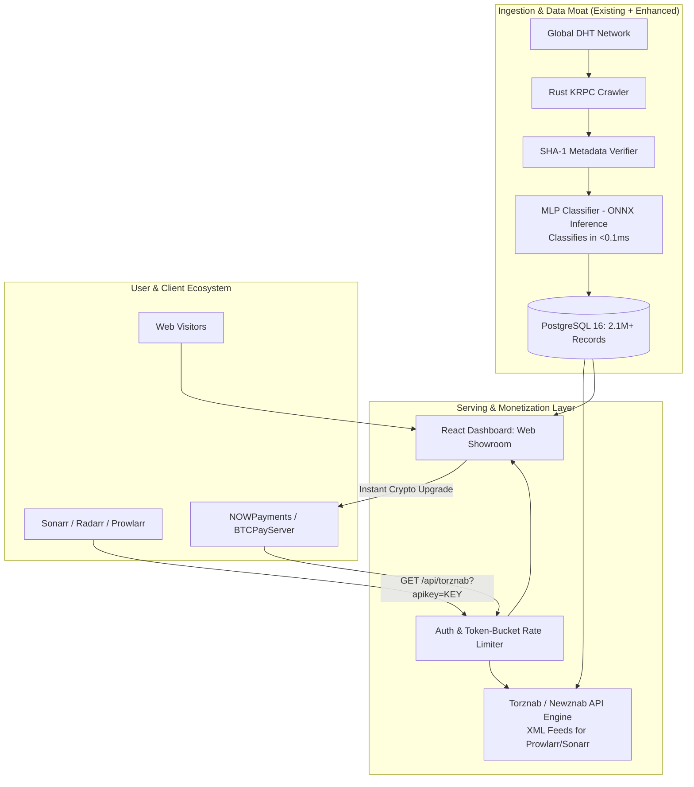
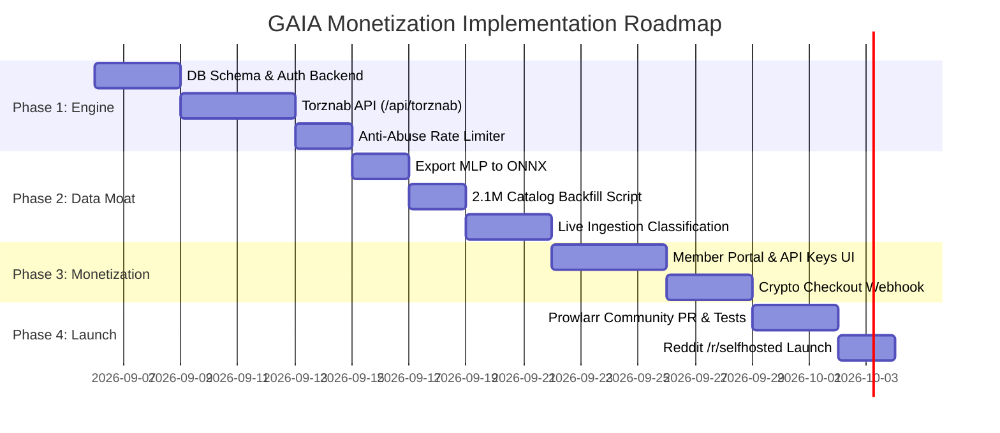

# GAIA Master Monetization & Technical Architecture Plan
**From Distributed DHT Crawler to High-Profit AI-Powered Torznab Indexer & VIP Platform**

---

## 1. Executive Summary & Vision

### The Core Opportunity
The modern self-hosted media landscape (home servers running **Prowlarr, Sonarr, Radarr, Jellyseerr, Plex, Jellyfin, and Stremio**) has exploded into a multi-million-dollar consumer market. Users demand fully automated, hands-off media retrieval.

Currently, this market relies on two flawed options:
1. **Usenet (e.g., NZBGeek)**: Requires paying for both the indexer ($15/yr) *and* an expensive newsgroup provider ($120–$150/yr), yet suffers from rampant DMCA automated chunk deletions that break 98% completed downloads.
2. **Public Torrent Trackers (1337x, TPB, etc.)**: Free, but filled with misclassified releases, broken episode naming, adult content leakage, malware `.exe` files, and dead swarms with 0 seeders.

### GAIA's Winning Position: The "Clean, Zero-Failure" Data Moat
GAIA solves both sides of the market:
- **Zero Provider Cost**: Delivers the speed and automation of Usenet without requiring a $150/year newsgroup subscription.
- **Immune to DMCA Chunk Deletions**: BitTorrent DHT swarms cannot be killed by a single notice to a server.
- **AI-Powered Classification (MLP Model)**: Replaces flawed regex with **89.5% accuracy, 96.3% confidence**, eliminating misclassified releases and NSFW leakage.
- **Predictive Swarm Health Telemetry**: Live probes verify peer health, ensuring Sonarr/Radarr skip dead swarms before downloading.
- **Massive 2.1M+ Verified Library**: Solves the cold-start problem from Day 1.

---

## 2. Product Architecture: "Web Showroom + Torznab Engine"



### Component A: The Web Showroom (`apps/dashboard/client`)
- **Conversion Machine**: Lets visitors browse the 2.1M catalog, search titles, inspect verified file trees, and check real-time velocity metrics.
- **Member Portal**:
  - Displays user's personal Torznab URL (1-click copy for Prowlarr).
  - Real-time quota gauge (e.g., `18 / 2,500 calls used today`).
  - Upgrade modal with non-custodial crypto checkout (USDT-TRC20, BTC, LTC, XMR).

### Component B: Torznab API Engine (`apps/dashboard/server.js`)
- Standard Newznab/Torznab specification:
  - `?t=caps`: Category capabilities (`2000` Movies, `5000` TV, `5070` Anime, `4000` Apps, `1000` Games, `3000` Audio).
  - `?t=search`, `?t=movie`, `?t=tvsearch`: Fast full-text search with season/episode filters.
  - Returns standard XML feeds with `<enclosure>` magnet/torrent links, file size, seeders, and verified SHA-1 infohashes.

---

## 3. The Data Moat: Productionizing the MLP Classifier

The MLP classifier located in `apps/classifier` is the cornerstone of GAIA's competitive advantage.

### High-Throughput ONNX Pipeline
1. **Export**: Export the trained PyTorch/scikit-learn MLP model and TF-IDF vectorizer to **ONNX format**.
2. **Inference Performance**: < 0.1ms per item on a standard CPU (10,000 classifications/sec).
3. **2.1M Catalog Backfill**:
   - A multi-threaded worker script processes the 2.1M unclassified records in PostgreSQL.
   - Entire backfill completes in **under 30 minutes**.
4. **Live Classification**:
   - Incoming verified torrents from the Rust crawler are classified before insertion or micro-batched every 30 seconds.
5. **Active Learning Flywheel**:
   - Items with softmax confidence `< 0.65` are flagged for automated low-cost LLM review (DeepSeek).
   - High-value corrections are appended to the training corpus for periodic weekly retraining.

---

## 4. Anti-Abuse, Rate Limiting & Key Protection

To prevent users from buying a Lifetime key and resharing it on forums, Telegram, or through scraping proxies:

```mermaid
graph LR
    Req[Incoming Query: ?apikey=...] --> Burst[1. Token Bucket Burst<br/>Max 5 req/sec]
    Burst -->|Exceeded| E429[429 Too Many Requests]
    
    Burst --> IPCheck[2. Rolling 24h IP Diversity<br/>Max 3 distinct IPs / 24h]
    IPCheck -->|4th distinct IP| Freeze[403 Key Suspended for Resharing]
    
    IPCheck --> Quota[3. Daily Quota Ceiling<br/>Free: 25 | VIP: 2.5k | Life: 5k]
    Quota -->|Depleted| EQuota[429 Daily Limit Reached]
    
    Quota --> OK[Allow Query & Fetch DB]
```

### The 4 Security Layers:
1. **The Rolling 24-Hour IP Diversity Limit (The "Real-Debrid" Rule)**:
   - For every API key, the server tracks unique IPs in a rolling 24-hour set (in-memory or Redis).
   - **Allowed**: Up to 3 distinct IPs (covers home router + dynamic ISP reassignment + mobile).
   - **Trigger**: The moment a 4th distinct geographic IP is seen, the key is **immediately locked**.
2. **Burst Rate Limiting**:
   - Max 5 requests/second. Kills proxy aggregators and scrapers attempting concurrent requests for multiple people.
3. **Daily Soft Quotas**:
   - "Lifetime" means no renewals, not infinite queries. Capped at **5,000 queries/day** (legitimate power users rarely exceed 1,200).
4. **Instant Self-Service Key Regeneration**:
   - If an account is locked due to multi-IP abuse, the owner can click "Regenerate Key" in the dashboard, instantly invalidating all shared/leaked copies.

---

## 5. Monetization Tiers & Financial Projections

### Pricing Tiers:
| Tier | Price | Daily Limits | Target Audience |
| :--- | :--- | :--- | :--- |
| **Free (Taster)** | $0 | 25 calls / day | Onboarding hook; indexer testing in Prowlarr. |
| **VIP Annual** | **$20.00 / year** ($1.66/mo) | 2,500 calls / day, 500 grabs/day | Standard self-hosters running Sonarr/Radarr. |
| **VIP Lifetime** | **$50.00 one-time** | 5,000 calls / day, unlimited grabs | Power users, homelab enthusiasts. |

### 12-Month Financial Projections (Fixed Infrastructure: ~$40/mo):
| Metric | Month 1 | Month 3 | Month 6 | Month 9 | Month 12 (Mature) |
| :--- | :--- | :--- | :--- | :--- | :--- |
| **Active Free Users** | 500 | 2,500 | 8,000 | 12,200 | **15,000** |
| **Cumulative Paying VIPs** | 35 | 190 | 580 | 970 | **1,250** |
| **Monthly Gross Cash Flow** | $910 | $2,340 | $3,900 | $3,120 | **$2,080** |
| **Cumulative Gross Revenue** | $910 | $4,940 | $15,080 | $25,220 | **$32,500** |
| **Cumulative Server Costs** | $40 | $120 | $240 | $360 | **$480** |
| **Cumulative Net Profit** | **$870** | **$4,820** | **$14,840** | **$24,860** | **$32,020** |
| **Net Profit Margin** | 95.6% | 97.5% | 98.4% | 98.5% | **98.5%** |

*(In Year 2, annual subscribers begin recurring renewals, providing a passive baseline of $1,500–$2,500/month).*

---

## 6. Phased Implementation Roadmap



### Phase 1: Torznab API & Auth Engine
- Create `users`, `api_keys`, and `daily_usage` tables in Postgres.
- Implement `/api/torznab` with `?t=caps`, `?t=search`, `?t=movie`, and `?t=tvsearch`.
- Implement burst and 24-hour IP diversity rate-limiting middleware.

### Phase 2: MLP Classifier Integration & Backfill
- Export MLP PyTorch model to ONNX format.
- Run batch script to backfill `category`, `category_id`, and `confidence` on all 2.1M torrents.
- Hook into crawler's verification pipeline for automated real-time tagging.

### Phase 3: Member Portal & Automated Crypto Payments
- Add "Account & API" tab to React dashboard (API key display, copy-for-Prowlarr button, usage meter).
- Integrate non-custodial crypto checkout (NOWPayments or BTCPayServer) with automated webhook account upgrades.

### Phase 4: Go-to-Market & Prowlarr Submission
- Test with real Prowlarr, Sonarr, and Radarr instances.
- Submit GAIA to the official Prowlarr Community Indexers repository.
- Launch community announcement on Reddit (`/r/selfhosted`, `/r/prowlarr`).

---

## 7. Operational & Legal Risk Management

1. **Information Location Tool Immunity**: GAIA operates strictly as a metadata indexer and search provider. GAIA does not store, transfer, or host any media bytes.
2. **Decentralized Crypto**: All payments processed via non-custodial cryptocurrency (USDT, BTC, LTC, XMR) to prevent payment processor freezes.
3. **DMCA Compliance**: Maintain a simple automated `/dmca` removal endpoint to remove flagged infohashes upon request, preserving safe-harbor status while leaving the underlying global swarm untouched.
