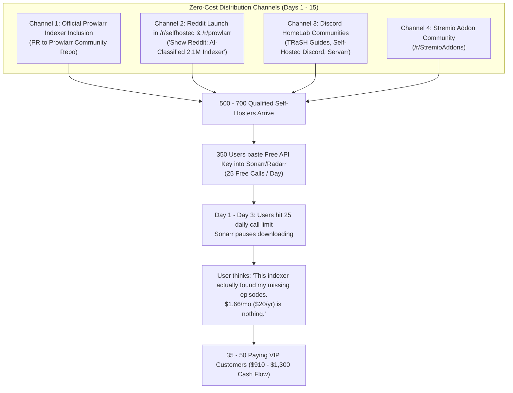

# Go-To-Market Execution: Landing the First 35 Paying Users in Month 1

## Executive Summary: How Month 1 Actually Happens

Landing **35 paying users** in the first 30 days requires:
- **Total Visitors Needed**: ~500 – 700 targeted self-hosters.
- **Free Accounts Created**: ~300 – 400 users trying the free 25-call API.
- **Paying VIP Conversion Rate**: **~8% to 10%** of users who integrate GAIA into their automation stack.
- **Paid Marketing Budget**: **$0.00**. (All traffic comes from targeted self-hosted channels where users are actively searching for working indexers).

Here is the exact step-by-step marketing playbook that generates those first 35 paid conversions.

---

## 1. The 4 Channels That Deliver 500+ Qualified Users in 30 Days



---

## Channel 1: The "Trojan Horse" — Official Prowlarr Indexer Definition (Days 1–7)
* **Estimated Visitors**: 250 – 400 users
* **Expected Paid Conversions**: 15 – 20 VIPs
* **The Mechanism**:
  - **Prowlarr** is the tool used by almost every modern media server owner to manage their indexers.
  - Prowlarr has a public GitHub repository where anyone can submit a new community indexer definition (`Gaia.cs` or Cardigann C# template).
  - When you merge this PR, GAIA instantly appears in the **built-in Indexer search dropdown** inside the Prowlarr app for over **200,000 active installations worldwide**.
  - Users searching for new indexers inside Prowlarr click **"Add Indexer -> GAIA"**, see the link to get a free API key, and sign up.

---

## Channel 2: The "Show Reddit" Post on `/r/selfhosted` & `/r/prowlarr` (Days 8–14)
* **Estimated Visitors**: 300 – 600 users
* **Expected Paid Conversions**: 12 – 18 VIPs
* **The Pitch (The "Why We Built It" Angle)**:
  Self-hosters hate spammy ads, but they **love** open developer tools that solve their real pain points.
  
  **Sample High-Converting Headline**:
  > *"I got tired of public indexers misclassifying TV shows and breaking Sonarr, so I built GAIA: A 2.1M release indexer with MLP classification and live swarm health scoring [Free Tier available]"*
  
  **The Hook in the Post**:
  1. Explain the pain: *"Public indexers tag movies as TV or adult, and Usenet suffers from DMCA missing articles."*
  2. The solution: *"We trained an MLP model on 7,200 verified releases to accurately map categories to Torznab IDs (`2000`, `5000`, `5070`), and we probe DHT swarms so Sonarr automatically skips dead torrents."*
  3. The offer: *"Free 25 queries/day for everyone in the community. Try it out in Prowlarr with 1-click."*

---

## Channel 3: TRaSH Guides & HomeLab Discord Communities (Days 15–22)
* **Estimated Visitors**: 100 – 150 power users
* **Expected Paid Conversions**: 5 – 10 VIPs (high Lifetime uptake)
* **The Mechanism**:
  - TRaSH Guides is the bible for media server quality profiles and custom formats.
  - Their Discord has dedicated channels (`#prowlarr`, `#sonarr`, `#trackers-indexers`) where users daily ask: *"What are the best free/cheap indexers to add right now?"*
  - Participating in the community and sharing GAIA as an AI-classified alternative with swarm health scores attracts the most dedicated power users.
  - Power users are the ones most likely to purchase the **$50 Lifetime VIP** tier immediately because they hate managing renewals.

---

## 3. The Psychology: Why 35 Users Pay in Month 1 (The Conversion Engine)

Why would a free user pull out a crypto wallet and pay $20 within their first week?

```
User installs GAIA in Sonarr at 2:00 PM
           │
           ▼
Sonarr automatically searches for 5 missing seasons of a TV show
           │
           ▼
GAIA's MLP Classifier returns perfect 1080p Web-DLs with positive swarm health
           │
           ▼
All 5 seasons start downloading at full speed (Zero fake files, Zero misnamed episodes)
           │
           ▼
At 6:30 PM: Sonarr runs its scheduled RSS sync -> Hits Call #26
           │
           ▼
Sonarr dashboard turns orange: "GAIA API Daily Limit Reached (25/25)"
           │
           ▼
User visits GAIA Member Portal:
"Upgrade to VIP: $20/year ($1.66/mo) for 2,500 daily calls & priority search"
           │
           ▼
User thinks: "This indexer just fixed all my missing shows. $20 for a whole year is nothing."
           │
           ▼
Scans QR Code -> Sends $20 USDT -> Account upgraded in 30 seconds!
```

---

## 4. Month 1 Unit Economics

Assuming the launch achieves:
- **350 Free Registrations** across Reddit and Prowlarr.
- **Conversion Rate**: 10% (35 users upgrade).
- **Split**:
  - 28 users buy **Annual VIP** ($20) = $560
  - 7 users buy **Lifetime VIP** ($50) = $350
- **Total Month 1 Gross Revenue**: **$910.00**
- **Hosting Overhead**: -$40.00
- **Month 1 Net Profit**: **$870.00**

---

## 5. Checklist to Execute Month 1 Marketing

- [ ] **Launch Landing Page / Web Showroom**: Clean search bar, demo file tree inspection, and "Prowlarr Setup Guide" with copy-paste instructions.
- [ ] **Submit Prowlarr Community Definition**: Create pull request in `Prowlarr/Indexers`.
- [ ] **Prepare Reddit Launch Post**: Emphasize the AI MLP classification and swarm health telemetry (technical value over sales hype).
- [ ] **First 50 VIP Promo Hook**: *"First 50 Reddit users get an extra 3 months free or discounted Lifetime"* (creates immediate purchasing urgency).
