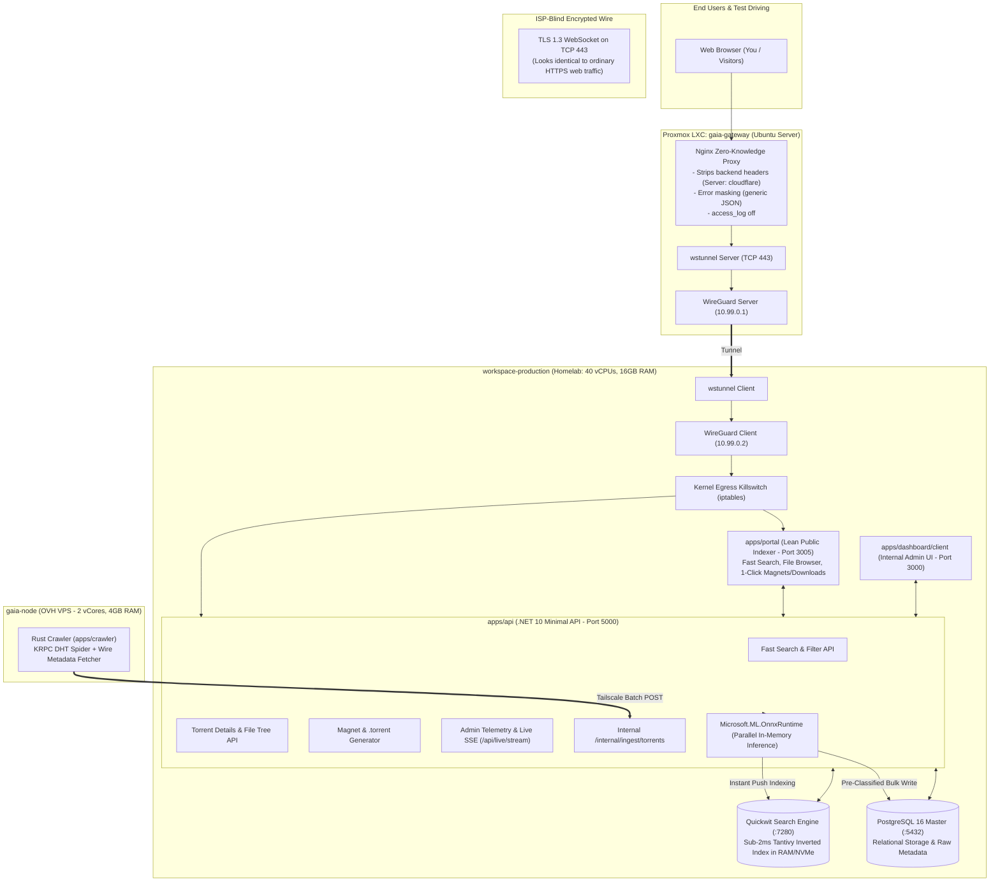
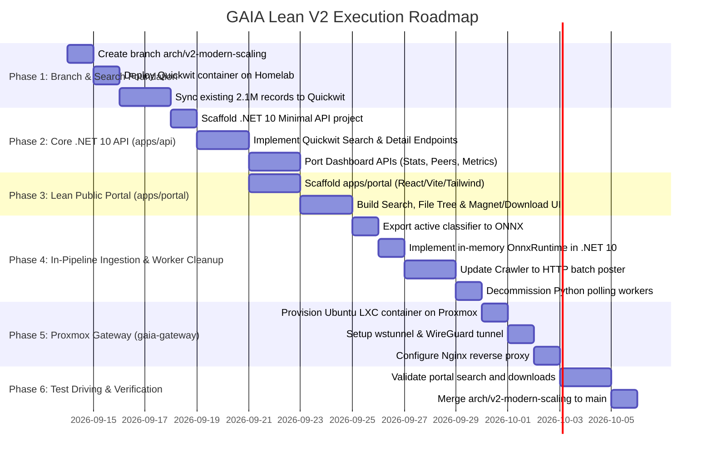

# GAIA Lean V2 Architecture & Modernization Plan
**The Core Foundation: Unified .NET 10 Backend, Quickwit Sub-2ms Search, and Lean Public Indexer Portal**

---

## 1. Goal Description & Scope Focus

### The Vision: Start Small, Move to the New Architecture First, Test Drive, Then Expand
Per your guidance, we are stripping away all commercial monetization features for now (no Torznab XML feeds, no auth system, no user login, no API keys, no crypto). 

Instead, we focus 100% on **fixing the cluttered codebase, eliminating performance bottlenecks, and proving the new architecture**:

1. **Decouple Search from PostgreSQL**: Deploy **Quickwit** to handle full-text search across 2.1M+ torrents with sub-2ms query latency, relieving PostgreSQL of all `ILIKE` and trigram strain.
2. **Unified .NET 10 Backend (`apps/api`)**:
   - Implement backend services in **C# ASP.NET Core in .NET 10 Minimal APIs** located in `apps/api`.
   - Host the public indexer search APIs, metadata lookups, magnet/torrent generators, and all internal admin dashboard telemetry APIs.
   - Completely retire the 2,357-line Express `server.js` monolith (zero Node.js backend runtime).
3. **Lean Public Indexer Portal (`apps/portal`)**:
   - A standalone, sleek, lightning-fast web portal (Vite + React + Tailwind).
   - **No authentication, no paywalls, no login**: Just a clean search engine where you (and public visitors) can search releases, inspect file trees and swarm health, and grab magnet links / download torrent files with 1 click.
4. **Clean In-Pipeline Ingestion & Worker Retirement**:
   - In-memory parallel ONNX inference in `apps/api` (<0.05ms/torrent).
   - Crawler posts verified metadata batches over Tailscale to `/internal/ingest/torrents`.
   - Python polling workers (`classifier-worker`, `scoring-worker`, `classifier-api`) are retired, saving ~2.5 GB of RAM and stopping MVCC table bloat on PostgreSQL.
5. **Zero Crawler Interruption**:
   - The live Rust crawler on `gaia-node` and PostgreSQL will continue running undisturbed while the new stack is built and tested in parallel on the dedicated branch `arch/v2-modern-scaling`.
6. **Proxmox LXC Gateway (`gaia-gateway`)**:
   - Deploy an Ubuntu Server LXC container on your Proxmox host to act as the clean, zero-knowledge reverse proxy and `wstunnel`/WireGuard tunnel endpoint.

---

## 2. System Architecture & Topology

---

## 3. Component Details: What We Are Building

### 1. Unified .NET 10 API (`apps/api`)
Replaces `server.js` with clean, modular Minimal API endpoints:
* **Public Search & Details**:
  - `GET /api/torrents?q={query}&category={cat}&page=1&limit=25`: Fast full-text search directly against Quickwit (latency < 2ms).
  - `GET /api/torrents/{infohash}`: Full torrent metadata, piece count, swarm health, and verified file tree.
  - `GET /api/torrents/{infohash}/magnet`: Generates optimized magnet link with tracker list.
  - `GET /api/torrents/{infohash}/torrent`: Streams raw `.torrent` bencoded file dynamically from info dict.
* **Internal Admin Dashboard & Telemetry**:
  - `GET /api/stats`: High-level crawler and database statistics.
  - `GET /api/metrics/current` & `/api/metrics/history`: Real-time hardware and network metrics.
  - `GET /api/peers` & `/api/peers/{ip}/{port}/torrents`: Live peer outcome telemetry.
  - `GET /api/surveillance/nodes` & `/api/surveillance/blocklist.txt`: Security/surveillance node monitor.
  - `GET /api/live/stream`: Server-Sent Events (SSE) live telemetry stream via `IAsyncEnumerable`.
* **High-Throughput Ingestion**:
  - `POST /internal/ingest/torrents`: Receives verified metadata batches from crawler over Tailscale, runs multi-core ONNX inference (<0.05ms/torrent), writes pre-classified records to PostgreSQL, and indexes into Quickwit simultaneously.

### 2. Lean Public Indexer Portal (`apps/portal`)
A dedicated, high-performance web application (Vite + React + Tailwind CSS):
* **Hero Search Bar**: Instant search with fast typing debounce and category filters (Movies, Television, Anime, Games, Applications, Music, Books).
* **Search Results View**:
  - Clean table/cards with Title, Category, Size, Swarm Health indicator, and Age.
  - Zero clutter, zero ads, zero tracking scripts.
* **Torrent Detail Modal / Page**:
  - Verified SHA-1 infohash.
  - Interactive file tree view (browse folders, file names, file sizes).
  - Swarm health status (active peer telemetry).
  - **1-Click Actions**:
    - "Copy Magnet" (with visual toast confirmation).
    - "Download .torrent" (instant browser file download).

### 3. Quickwit Search Engine (`apps/quickwit`)
* Runs as a lightweight Docker container on `workspace-production`.
* Maintains Tantivy inverted index on local NVMe/RAM.
* Replaces all PostgreSQL `ILIKE` trigram queries.

### 4. Admin Dashboard UI (`apps/dashboard/client`)
* Existing React client adapted to query `apps/api:5000` instead of the legacy Express server.
* `apps/dashboard/server.js` is deleted, freeing Node.js memory.

---

## 5. Phased Execution Roadmap (Zero Crawler Disruption)

### Milestone Steps:

#### Phase 1: Git Feature Branch & Quickwit Setup
1. Create and switch to git branch `arch/v2-modern-scaling`.
2. Configure `apps/quickwit/config/quickwit.yaml` and `apps/quickwit/schemas/torrents-schema.yaml`.
3. Add `quickwit` container (port 7280) to `deploy/targets/workspace-production/docker-compose.yml`.
* **Crawler Status**: Crawling and writing to PostgreSQL uninterrupted.

#### Phase 2: Core .NET 10 API (`apps/api`)
1. Create `apps/api` targeting `net10.0` with `mcr.microsoft.com/dotnet/sdk:10.0`.
2. Implement `QuickwitClient.cs`: Fast HTTP queries to Quickwit for search and category filtering.
3. Implement `TorrentsEndpoint.cs`: `/api/torrents`, `/api/torrents/{infohash}`, `/api/torrents/{infohash}/magnet`, and `/api/torrents/{infohash}/torrent`.
4. Implement `DashboardEndpoints.cs`: Port `/api/stats`, `/api/metrics/*`, `/api/peers`, `/api/surveillance/*`, and `/api/live/stream` (SSE).

#### Phase 3: Lean Public Portal (`apps/portal`)
1. Scaffold `apps/portal` with Vite + React + Tailwind CSS.
2. Build responsive search interface with real-time query results (<2ms backend response).
3. Build detail drawer/modal: file tree explorer, swarm health badge, 1-click magnet copy, and 1-click `.torrent` download.
4. Update `apps/dashboard/client` to use `apps/api:5000` for admin metrics; delete `server.js`.

#### Phase 4: In-Pipeline Ingestion & Worker Cleanup
1. Export active model (`torrent_classifier_v8...joblib`) to ONNX.
2. Implement `OnnxClassifierService.cs` in `apps/api`.
3. Expose `POST /internal/ingest/torrents` in `apps/api`.
4. Update `apps/crawler` to post verified metadata batches to this endpoint.
5. Decommission `classifier-worker`, `scoring-worker`, and `classifier-api`, freeing ~2.5 GB RAM.

#### Phase 5: Proxmox LXC Gateway (`gaia-gateway`)
1. Using your Proxmox credentials, provision the Ubuntu LXC container.
2. Configure `wstunnel-server` and WireGuard (`10.99.0.1`).
3. Configure `wstunnel-client` and WireGuard (`10.99.0.2`) on `workspace-production`.
4. Configure Nginx reverse proxy with header stripping and error masking.

#### Phase 6: Test Driving
1. You test-drive the public portal on desktop and mobile for search speed, accuracy, and file downloads.
2. Once satisfied with stability and speed over a few weeks, merge to `main`.
3. In a future update, we can incrementally add Torznab feeds, user accounts, API keys, and monetization without changing the underlying architecture.

---

## 6. Verification Plan

1. **Search Speed**: Test search queries across 2.1M records via the portal: confirm P95 latency is under 15ms.
2. **Download Integrity**: Click "Download .torrent" and "Copy Magnet" for various torrents; verify they import cleanly into a torrent client (qBittorrent/Transmission).
3. **Database Health**: Verify PostgreSQL CPU stays < 5% during searches and dead-tuple bloat is stopped after Python worker decommissioning.
4. **Zero Crawler Interruption**: Verify the crawler log continues showing active KRPC discovery and verified metadata downloads without dropping packets.
