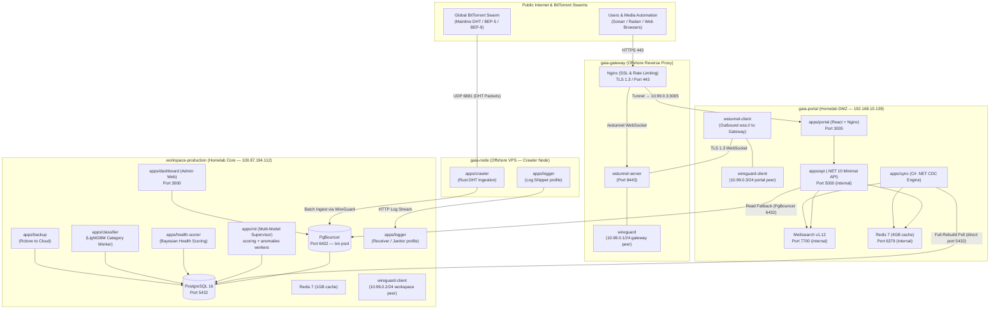

# GAIA — Master System Architecture & Ecosystem Reference

> **The Definitive Source of Truth for the GAIA Ecosystem**  
> *Last Updated: September 2026 — Reflects commit `30b1f7a`*

---

## Table of Contents
1. [Executive Summary & System Vision](#1-executive-summary--system-vision)
2. [Global Architecture & Network Topology](#2-global-architecture--network-topology)
3. [Applications Catalog (All 11 Apps)](#3-applications-catalog-all-11-apps)
   - [3.1 `apps/crawler` — Rust DHT Ingestion Engine](#31-appscrawler--rust-dht-ingestion-engine)
   - [3.2 `apps/api` — .NET 10 High-Velocity Search & Torznab API](#32-appsapi--net-10-high-velocity-search--torznab-api)
   - [3.3 `apps/portal` — Modern Public Search Web Portal](#33-appsportal--modern-public-search-web-portal)
   - [3.4 `apps/dashboard` — Administrative Control Center & Telemetry](#34-appsdashboard--administrative-control-center--telemetry)
   - [3.5 `apps/classifier` — ML Category Inference Worker](#35-appsclassifier--ml-category-inference-worker)
   - [3.6 `apps/ml` — Multi-Model ML Supervisor (Scoring + Anomalies)](#36-appsml--multi-model-ml-supervisor-scoring--anomalies)
   - [3.7 `apps/health-scorer` — Bayesian Swarm Health Scoring Engine](#37-appshealth-scorer--bayesian-swarm-health-scoring-engine)
   - [3.8 `apps/sync` — Meilisearch Full-Rebuild Synchronizer](#38-appssync--meilisearch-full-rebuild-synchronizer)
   - [3.9 `apps/tunnel` — WebSocket WireGuard Encapsulator (`wstunnel`)](#39-appstunnel--websocket-wireguard-encapsulator-wstunnel)
   - [3.10 `apps/backup` — Automated Disaster Recovery Worker](#310-appsbackup--automated-disaster-recovery-worker)
   - [3.11 `apps/logger` — Distributed Log Shipper & Janitor](#311-appslogger--distributed-log-shipper--janitor)
4. [Deployment Targets & Infrastructure Roles](#4-deployment-targets--infrastructure-roles)
   - [4.1 `workspace-production` (Homelab Core)](#41-workspace-production-homelab-core)
   - [4.2 `gaia-gateway` (Offshore VPS Proxy)](#42-gaia-gateway-offshore-vps-proxy)
   - [4.3 `gaia-portal` (Public Web Serving Node)](#43-gaia-portal-public-web-serving-node)
   - [4.4 `gaia-node` (External VPS Crawler Node)](#44-gaia-node-external-vps-crawler-node)
5. [Air-Tight Homelab OpSec & ISP-Blindness Model](#5-air-tight-homelab-opsec--isp-blindness-model)
6. [Data Pipeline & Storage Architecture](#6-data-pipeline--storage-architecture)
7. [3-Pillar Scoring Taxonomy](#7-3-pillar-scoring-taxonomy)
8. [Operations & Deployment Runbook](#8-operations--deployment-runbook)

---

## 1. Executive Summary & System Vision

**GAIA** is an enterprise-grade, decentralized BitTorrent indexing, machine-learning classification, search, and telemetry ecosystem. It crawls the global DHT network, classifies and scores every discovered torrent across three orthogonal dimensions (health, popularity, and trust), and serves results through both a public search portal and media-automation APIs (Torznab).

**Key Statistics (Production, September 2026):**
- **3,200,000+** torrents indexed in PostgreSQL
- **3,164,352** documents in Meilisearch
- **Sub-10 ms** typical search latency (Meilisearch path)
- **94.4% empirical calibration precision** on Bayesian health scorer (verified against wire probes)
- **0 open inbound ports** on home router; all traffic through encrypted WireGuard-in-WebSocket tunnel

### Core Architectural Tenets
1. **Decoupled Ingestion & Serving**: High-volume DHT crawling runs on external offshore VPS nodes. The homelab server never performs raw DHT crawl operations.
2. **Air-Tight Homelab OpSec**: Zero public DNS pointing home, zero forwarded ports, all traffic through TLS 1.3 WebSocket tunnel (`wstunnel`) on port 443, indistinguishable from HTTPS banking traffic to ISP DPI.
3. **Sub-Millisecond Search**: Meilisearch primary path with L1 in-memory + L2 Redis cache. PostgreSQL trigram fallback with circuit breaker. Automated `*arr` (Sonarr/Radarr/Prowlarr) Torznab compatibility.
4. **Three-Layer ML Intelligence**: (a) LightGBM category classifier, (b) TrustClassifier scoring engine with policy v3.0.0, (c) Isolation Forest + Autoencoder anomaly detector with calibration drift tracking.

---

## 2. Global Architecture & Network Topology



### WireGuard Peer Addressing
| Peer | Interface IP | Role |
| :--- | :--- | :--- |
| `gaia-gateway` | `10.99.0.1/24` | Server — accepts connections from all clients |
| `workspace-production` | `10.99.0.2/24` | Homelab core — routes crawler ingest through tunnel |
| `gaia-portal` | `10.99.0.3/24` | Public-facing portal node |

---

## 3. Applications Catalog (All 11 Apps)

### 3.1 `apps/crawler` — Rust DHT Ingestion Engine

* **Language & Runtime**: Rust (2024 edition), Tokio async runtime, `jemalloc` allocator (configured for background thread decay).
* **Deploy Host**: `gaia-node` (external VPS, `network_mode: host`), `ulimits.nofile: 65536`.
* **Key Crate Dependencies**: `sqlx` (async PostgreSQL), `tokio`, `redis` (async connection manager), `dashmap`, `librqbit-utp`, `sha1`, `socket2`, `bincode`, `tracing`.

#### Module Architecture (`src/`)
```
src/
├── dht/           # Kademlia routing table, node discovery, BEP-5 Walker
├── harvest/       # Infohash event stream, dual Bloom filter deduplication (current + previous window),
│                  #   announce_seen Bloom filter, TombstoneFilter anti-recrawl integration
├── krpc/          # KRPC UDP protocol (get_peers, announce_peer, find_node),
│                  #   NodeId, TokenGenerator, TxTable (transaction state)
├── net/           # Rate limiter (UDP packet budget)
├── storage/       # PostgreSQL write path:
│   ├── batch_writer.rs          # Bulk upsert to torrents table
│   ├── observations.rs          # Writes torrent_availability_observations (dht_sighting, peer_seen, etc.)
│   ├── sightings.rs             # Writes infohash_sightings (first_seen / last_seen / source_counts)
│   ├── surveillance.rs          # Records dht_surveillance_nodes (BEP-42 violation tracking)
│   ├── pending_infohashes.rs    # Schedules BEP-9 metadata fetch jobs
│   ├── tombstone_filter.rs      # Reads blocked_infohashes to suppress recrawling disabled categories
│   ├── jobs.rs                  # VerifyStore — retry queue management for metadata fetches
│   └── janitor.rs               # Prunes stale / dead verification jobs
├── verify/        # BEP-9/BEP-10 metadata fetch over TCP:
│   ├── fetch_pool.rs            # Concurrent peer connection pool (FetchParams)
│   └── peer_cache.rs            # Short-lived peer address LRU cache
├── router.rs      # Main event routing loop
├── metrics.rs     # Atomic counters (torrents/sec, peers/sec, wire success/fail)
├── config.rs      # TOML config loader
├── trace.rs       # Tracing / structured logging configuration
└── main.rs        # Process entrypoint — initialises all subsystems
```

#### Key Responsibilities
- **BEP-5 DHT Walker**: Kademlia routing table traversal, bootstraps from DHT seed nodes, sends `get_peers` and processes `announce_peer` responses.
- **BEP-10 / BEP-9 Metadata Fetch**: Connects to confirmed seeders over TCP, performs Extension Protocol handshake, fetches raw bencoded info dictionary via `ut_metadata`. Races up to 5 concurrent peers per infohash.
- **Bloom Filter Deduplication**: Dual-window Bloom filters (current + previous epoch) prevent re-queuing infohashes already processed. `announce_seen` filter deduplicates `announce_peer` events within a DHT crawl cycle.
- **Tombstone Anti-Recrawl**: Reads `blocked_infohashes` table on startup to build a TombstoneFilter; ignores any infohash from a disabled category without hitting the DB again.
- **Surveillance Recording**: Tracks IP addresses exhibiting BEP-42 violations (fabricated node IDs), increments `bep42_violations` score, writes to `dht_surveillance_nodes`. Suspected monitoring entities are auto-blocked.
- **Observation Writing**: After each wire probe attempt, writes a structured `torrent_availability_observations` row (type: `metadata_fetch_success` / `metadata_fetch_failure` / `dht_sighting` / `peer_seen` / `seed_confirmed`).

#### Key Configuration (`CRAW_CONFIG_DIR/`)
| Variable | Default | Description |
| :--- | :--- | :--- |
| `CRAW_EXTERNAL_IP` | required | Public IP of the crawler node (used in DHT node ID generation) |
| `CRAW_PROFILE` | `production` | Execution profile (`production` / `development`) |
| `DATABASE_URL` | required | PostgreSQL connection string |
| `RUST_LOG` | `info` | Log level filter |
| `MALLOC_CONF` | `background_thread:true,dirty_decay_ms:500,...` | jemalloc memory decay tuning |

---

### 3.2 `apps/api` — .NET 10 High-Velocity Search & Torznab API

* **Language & Runtime**: C# (.NET 10 Minimal API), Kestrel web server, Dapper + Npgsql for PostgreSQL access, StackExchange.Redis.
* **Deploy Hosts**: `workspace-production` (bundled in `gaia-dashboard` image, `SEARCH_PROVIDER=PostgreSQL`) and `gaia-portal` (as `gaia-portal-api`, `SEARCH_PROVIDER=Meilisearch`).

#### API Endpoint Groups

| Prefix | File | Description |
| :--- | :--- | :--- |
| `GET /api/torrents` | `TorrentEndpoints.cs` | Search/browse — delegates to ISearchProvider |
| `GET /api/torrents/{infohash}` | `TorrentEndpoints.cs` | Single torrent detail with files, peers, health |
| `GET /api/torrents/{infohash}/download` | `TorrentEndpoints.cs` | Live `.torrent` file build via `WireMetadataFetcher` |
| `GET /api/stats` | `DashboardEndpoints.cs` | Aggregated database statistics |
| `GET /api/live/stream` | `DashboardEndpoints.cs` | **SSE** — real-time telemetry (stats, metrics, scoring, alerts) |
| `GET /api/peers` | `PeersEndpoints.cs` | Live peer swarm data for a given infohash |
| `GET /api/alerts` | `AlertsEndpoints.cs` | ML operational alerts (list, resolve) |
| `POST /api/alerts/{id}/resolve` | `AlertsEndpoints.cs` | Mark alert as resolved |
| `GET /api/analysis/...` | `AnalysisEndpoints.cs` | Category breakdown, trend analysis |
| `GET /api/dashboard/...` | `DashboardTorrentEndpoints.cs` | Admin torrent table with full scoring details |
| `GET /api/metrics` | `MetricsEndpoints.cs` | Raw time-series metrics from `metrics` table |
| `POST /api/scoring/override` | `ScoringEndpoints.cs` | Manual policy action / risk tier override |
| `GET /api/surveillance/nodes` | `SurveillanceEndpoints.cs` | DHT surveillance node table |
| `POST /api/surveillance/nodes/{ip}/toggle` | `SurveillanceEndpoints.cs` | Block / unblock a surveillance node |
| `GET /api/categories` | `CategoryEndpoints.cs` | Category policy management |
| `POST /api/categories/{name}/toggle` | `CategoryEndpoints.cs` | Enable / disable a content category |
| `POST /api/classifier/reclassify` | `ClassifierEndpoints.cs` | Trigger on-demand reclassification batch |

#### Dual Search Provider Architecture

```
ISearchProvider (interface)
├── MeilisearchSearchProvider    ← Primary (sub-millisecond, typo-tolerant)
│   ├── L1: in-memory cache (15s TTL, MemoryCache)
│   ├── L2: Redis cache (generation-keyed, invalidation-safe)
│   ├── Circuit Breaker (trips OPEN after failures → instant failover)
│   ├── Smart Query Preprocessing (TorrentQueryParser — year disjunction, glued words)
│   ├── Multi-search native federation for year disjunction queries
│   ├── Relaxed retry (matchingStrategy: "last") on 0-hit multi-word queries
│   └── Retrieval Attributes: infohash, name, category, total_size, file_count,
│         verified_at, popularity_tier, risk_tier, policy_action, availability_state,
│         health_score, health_state, swarm_peers, seed_confirmed, popularity_score
└── PostgresTrigramSearchProvider ← Fallback (GIN full-text search, never cached)
    └── SQL: SELECT ... FROM torrents t LEFT JOIN health_scores hs ON hs.infohash = ...
              COALESCE(hs.health_score, t.health_score) AS health_score
              COALESCE(hs.health_state, t.availability_state) AS health_state
```

The `SEARCH_PROVIDER` environment variable controls which provider is registered as `ISearchProvider`. On `workspace-production`, PostgreSQL is used directly (Meilisearch is not available there). On `gaia-portal`, Meilisearch is primary.

#### Live `.torrent` File Builder (`WireMetadataFetcher` + `TorrentBuilder`)
- Fetches raw BEP-9 bencoded info dictionaries on-the-fly from up to 5 live peers (races them, cancels losers on first winner).
- `TorrentBuilder.BuildTorrentBuffer` constructs a complete `.torrent` file with zero-copy bencode serialization:
  - Ensures canonical dictionary key ordering (BEP-3 compliance).
  - Injects multi-tier tracker announce list (BEP-12) with 4 public trackers.
  - Validates SHA-1 piece hash alignment.

#### Caching Architecture
| Layer | Store | TTL | Scope |
| :--- | :--- | :--- | :--- |
| L1 | `IMemoryCache` (in-process) | 15 s | Per API instance |
| L2 | Redis DB 0 | Generation-keyed | Shared across instances |
| Suppression | Redis DB 0 | TTL per suppression rule | `gaia:suppressed:{infohash}` keys |
| Volatile metrics | Redis DB 1 | Short TTL | Swarm peer counts hydrated post-search |

---

### 3.3 `apps/portal` — Modern Public Search Web Portal

* **Language & Framework**: React 18, Vite, Tailwind CSS, Lucide Icons.
* **Served via**: Nginx reverse proxy on port 3005 (proxies `/api/*` to `gaia-portal-api:5000`).
* **Deploy Host**: `gaia-portal`.

#### UI Component Highlights

| Component | File | Description |
| :--- | :--- | :--- |
| `SecurityShield` | `HealthScoreDisplay.jsx` | Antivirus-style shield with score 0–100 and verdict labels (✅ Clean / ⚠️ Low-Risk / 🔶 Suspicious / 🚫 Threat Blocked) |
| `TrendingBadge` | `HealthScoreDisplay.jsx` | Search-indexer trending tiers: 🔥 Viral (80+) / 📈 Trending (60+) / 🌀 Rising (35+) / ❄️ Cold (<35) |
| `HealthStatePill` | `HealthScoreDisplay.jsx` | Colour-coded state pill with score-based derivation fallback (never shows UNKNOWN when score is known) |
| `EvidenceBreakdown` | `HealthScoreDisplay.jsx` | Bayesian evidence factor breakdown (direct_probe, seeders, peers, dht, failure_penalty) |
| `TorrentBrowser` | `TorrentBrowser.jsx` | Paginated search table: Swarm Health, Trending, Antivirus/Safety columns |

#### Nginx Proxy Configuration (port 3005)
- `proxy_cache` micro-cache: `/api/torrents` → 5 s TTL with `stale-while-revalidate`; `/api/stats` → 10 s TTL.
- Rate limiting: `limit_req_zone` 50 r/s, burst 150, exempts private network ranges.
- Gzip compression for `application/json` responses ≥ 1024 bytes.
- SSE endpoint (`/api/live/stream`) has `proxy_buffering off` and 3600 s read timeout.

---

### 3.4 `apps/dashboard` — Administrative Control Center & Telemetry

* **Language & Framework**: React 18, Vite, Recharts / Chart.js, Tailwind CSS, Zustand state stores.
* **Deploy Host**: `workspace-production` (bundled with the API in a single multi-stage Docker image; `SEARCH_PROVIDER=PostgreSQL`).
* **Port**: 3000.

#### Dashboard Views & Capabilities

| View | Description |
| :--- | :--- |
| **Live Telemetry** | Real-time SSE stream: torrents/sec, peers/sec, wire fetch rate, DB pool utilisation, ML worker health |
| **Torrent Browser** | Paginated admin table with full scoring data (health, trending, SecurityShield score, policy action) |
| **Torrent Detail Modal** | File tree, exact byte sizes, EvidenceBreakdown, SecurityShield, TrendingBadge, magnet link, `.torrent` download |
| **Classifier Studio / Adjudication** | `ClassifierView.jsx` — Antivirus & Threat Adjudication tab with SecurityShield replacing plain labels; Availability column removed; Downrank button removed |
| **Operational Alerts** | ML anomaly alerts from `operational_alerts` table; per-alert resolution |
| **Surveillance Nodes** | `dht_surveillance_nodes` table — BEP-42 violation scores, block/unblock |
| **Category Policies** | Enable/disable content categories; auto-purge toggle |
| **Scoring Overrides** | Manual policy action and risk tier override (`/api/scoring/override`) |
| **Analysis Charts** | Category breakdown, ingestion trend, health distribution histograms |

#### Store Architecture (`src/stores/`)
- `browserStore.js`: Torrent selection, inspection, file list normalisation (handles JSON string, array, and dict-keyed JSONB formats from PostgreSQL).
- Other stores: metrics, alerts, dashboard stats — all hydrated from SSE stream or REST polling.

---

### 3.5 `apps/classifier` — ML Category Inference Worker

* **Language & Runtime**: Python 3.11, LightGBM, Scikit-learn, FastAPI (Uvicorn), joblib.
* **Deploy Host**: `workspace-production` (`network_mode: host`, port 8080 for HTTP API).
* **Memory Limit**: 1500 MB.

#### Architecture
The classifier runs a **dual-process entrypoint** (`scripts/entrypoint.py` supervisor):
1. **Uvicorn (FastAPI)** — HTTP API at port 8080 for on-demand classification requests from the dashboard (`/api/classifier/reclassify`).
2. **Queue Worker (`src/reclassify_worker.py`)** — Continuously polls `torrents WHERE category IS NULL OR category = 'Other'` in batches of 2000, runs inference, writes results back.

#### Feature Extraction (`src/feature_extractor.py`)
- TF-IDF vectorizer with domain-specific stop words (packaging noise: `1080p`, `x264`, `bdrip`, `rarbg`, etc.) + corpus stop words from 3.2M torrent entropy analysis.
- Regex modality masks: `RE_TV`, `RE_ANIME`, `RE_ADULT`, `RE_AUDIOBOOK`, `RE_BOOK`, `RE_DOCU`, `RE_GAME`, `RE_APP`, `RE_MOVIE`, `RE_MUSIC`, `RE_JAV`.
- File extension categorisation by dominant type (video/audio/executable/archive/doc/junk).
- Shannon entropy of release name (detects hex-hash fake names).

#### Inference & Output
- **Model**: LightGBM multiclass classifier (active model loaded via `model_manager.get_active_model_path()`).
- **Outputs**: `category` (one of 11 canonical values) + `category_confidence` (0.00–1.00) written to `torrents` table.
- **Canonical Categories**: Movies, Television, Anime, Music, Books & Learning, Games, Applications, Adult, Audiobooks, Documentaries, Other.

---

### 3.6 `apps/ml` — Multi-Model ML Supervisor (Scoring + Anomalies)

* **Language & Runtime**: Python 3.11, PyTorch / Scikit-learn / joblib, numpy, psycopg2.
* **Deploy Host**: `workspace-production` (`network_mode: host`, `ENABLED_WORKERS=scoring,anomalies`).
* **Memory Limit**: 1500 MB.
* **Entrypoint**: `supervisor.py` — manages two OS-level subprocesses with independent GILs.

#### Supervisor Features
- **True Process Isolation**: Each worker runs as a separate `subprocess.Popen()` with its own Python interpreter — a crash in the anomaly worker cannot affect the scoring worker.
- **Crash Resilience**: Automatic restart with exponential backoff on process exit.
- **Health Watchdog**: Monitors `/tmp/scoring_worker_heartbeat` and `/tmp/anomaly_worker_heartbeat` files (written by workers every cycle). If a heartbeat goes stale beyond the threshold, the supervisor marks the container unhealthy for Docker.
- **Graceful Signal Propagation**: `SIGTERM` / `SIGINT` are forwarded to all children; 10 s grace period before `SIGKILL`.

---

#### 3.6.1 Scoring Worker (`apps/ml/scoring/`)

| Item | Detail |
| :--- | :--- |
| **Model** | `TrustClassifier v1.0.0` (LightGBM binary) — loaded from `model_registry/trust_classifier_v1.0.0.joblib` |
| **Policy Engine** | `policy/engine.py` — version `v3.0.0`, deterministic rule-based overlay on top of model probabilities |
| **Batch Size** | 500 torrents per cycle (configurable via `BATCH_SIZE`) |
| **Poll Interval** | 5 s (configurable via `POLL_INTERVAL`) |
| **Retraining** | Automatic every 168 h (7 days) with Gold Benchmark gating |
| **Availability Refresh** | Re-scores stale records where `scored_at < NOW() - 24h` |

**Feature Extraction (`src/features/integrity.py`):**
- Protocol geometry: piece length, file count, total size ratios.
- File tree analysis: dominant extension category, primary payload share, junk file ratio.
- Lexical signals: Shannon entropy, spam keyword detection (`crack`, `keygen`, `serial`, etc.), RTLO character check.
- Semantic features extracted via `src/features/semantic.py`.

**Policy Engine (`src/policy/engine.py`):**
- Computes `metadata_quality_score` (0–100) via explicit penalty deductions (missing title, hex-hash name, mismatched category size, etc.).
- Evaluates **Silver Rule Invariants** — deterministic hard rules that unconditionally trigger `SUPPRESS` / `BLOCKED`:
  - `CRITICAL_SHA1_MISMATCH` — SHA-1 hash does not match content
  - `EMPTY_PAYLOAD_FAKE` — Zero-byte or near-zero payload
  - `DECEPTIVE_DOUBLE_EXTENSION` — e.g., `.mp4.exe`
  - `EXECUTABLE_IN_MEDIA_SWARM` — `.exe` / `.scr` in a Movies/TV/Anime category torrent
  - `RTLO_CHAR_SPOOFING` — Unicode Right-to-Left Override in filename
  - `STANDALONE_SCRIPT_EXPLOIT` — Isolated script file as primary payload
- Outputs: `risk_tier` (SAFE / REVIEW / SUSPICIOUS / BLOCKED), `policy_action` (ALLOW / DOWNRANK / REVIEW / SUPPRESS), `integrity_score` (0–100), `decision_source` (MODEL / POLICY / MODEL_AND_POLICY / MANUAL).

**Score History**: Every scoring run appends an immutable audit row to `torrent_score_history` (keyed by `infohash + scoring_run_id + model_name`).

---

#### 3.6.2 Anomaly Detection Worker (`apps/ml/anomalies/`)

| Item | Detail |
| :--- | :--- |
| **Detection Cycle** | Every 15 minutes (`DETECTION_INTERVAL_MINUTES=15`) |
| **Retraining** | Every 24 h (`ANOMALIES_RETRAIN_INTERVAL_HOURS=24`) |
| **Alert Threshold** | Ensemble anomaly score ≥ 0.60 (`ALERT_MIN_SCORE=0.60`) |
| **Models** | Isolation Forest + Autoencoder (0.5 / 0.5 ensemble) + optional supervised classifier |
| **Hot-Reload** | `detector.reload_models()` — reloads model artifacts from disk without container restart |

**Incident Types Detected:**

| Incident | Description |
| :--- | :--- |
| `DB_LATENCY_SPIKE` | High PostgreSQL latency / blocked worker threads — lock contention or autovacuum |
| `DHT_DROP_COLLAPSE` | Severe drop in DHT inbound traffic — ISP filtering, routing table collapse |
| `TIMEOUT_CASCADE` | Surge in BEP-9 connection timeouts — IP block by major seedbox providers |
| `RESTART_EVENT` | Crawler process crash / OOM kill detected |
| `CALIBRATION_DRIFT` | **New**: Empirical accuracy drift — high-health predictions failing wire probes at >20% rate |
| `NORMAL` | All telemetry within normal statistical parameters |

**Calibration Drift Detector**: Cross-references `torrent_availability_observations` wire probes against predicted `health_scores`. If empirical precision on predicted-viable torrents drops below 80% (N ≥ 20 observations), fires a `CALIBRATION_DRIFT` alert into `operational_alerts`.

**Live Production Status**: `viable precision=0.944` across 927 observations — 94.4% empirical calibration accuracy confirmed.

---

### 3.7 `apps/health-scorer` — Bayesian Swarm Health Scoring Engine

* **Language & Runtime**: Python 3.11, psycopg2, numpy.
* **Deploy Host**: `workspace-production` (`network_mode: host`, `SHADOW_MODE=true` by default).
* **Memory Limit**: 1500 MB.

#### Purpose
A dedicated, deterministic Bayesian health scorer that computes **canonical health scores** from real wire probe evidence stored in `torrent_availability_observations`. Results are written to the separate `health_scores` table, keeping canonical scores decoupled from the `torrents` table's `health_score` column (which is written by the crawler at ingest time).

The dashboard API (`PostgresTrigramSearchProvider`) reads from both tables using a `LEFT JOIN health_scores hs ON hs.infohash = encode(t.infohash, 'hex')` and `COALESCE(hs.health_score, t.health_score)` — canonical scores take precedence.

#### Bayesian Formula (`src/formula.py`) — Algorithm v2.0.0

Input: `EvidenceFamilies` dataclass with 5 bounded evidence families:

| Family | Field | Description |
| :--- | :--- | :--- |
| **Direct Probe** | `direct_success_age_hours` | Hours since most recent successful metadata fetch (highest trust) |
| **Confirmed Seed** | `seed_age_hours` | Hours since most recent seed confirmation |
| **Peer Count** | `max_recent_peer_count`, `peer_evidence_age_hours` | Saturating log function on peer count from latest observation |
| **DHT Sightings** | `dht_sighting_count_12h`, `latest_dht_sighting_age_hours` | Count of distinct sightings in 12h window (capped) |
| **Failure Penalty** | `recent_failures_after_latest_success`, `latest_failure_age_hours` | Failures after latest success, capped at 3 before decay |

Output: `HealthScoreResult` — `health_score` (0–100), `health_confidence` (0.0–1.0), `health_state` (UNKNOWN / UNVERIFIED / VERIFIED / STALE), `algorithm_version`.

#### Evidence Aggregation (`src/evidence_aggregator.py`)
Reads raw `torrent_availability_observations` rows and aggregates them into `EvidenceFamilies`, applying:
- Age decay functions (recency weighting).
- Failure saturation cap (max 3 failures counted).
- 12-hour DHT sighting window.

#### Operational Modes
| Mode | `SHADOW_MODE` | `LEGACY_ADAPTER_ENABLED` | Behaviour |
| :--- | :--- | :--- | :--- |
| Shadow | `true` | `false` | Scores computed but only logged; no writes to `health_scores` |
| Production | `false` | `false` | Writes canonical scores to `health_scores` table |
| Legacy Compat | `false` | `true` | Reads from legacy `torrents` columns if observations absent |

#### Database Tables Owned
- `health_scores` — canonical output (one row per infohash)
- `health_scoring_cursor` — watermark cursor for incremental processing
- `health_calibration_snapshots` — periodic accuracy snapshots

---

### 3.8 `apps/sync` — Meilisearch Full-Rebuild Synchronizer

* **Language & Runtime**: **C# (.NET)**, `Gaia.Sync.csproj`, Dapper + Npgsql, StackExchange.Redis.
* **Deploy Host**: `gaia-portal`.

#### Architecture: Stateless Periodic Full Rebuild

Unlike a traditional CDC (change-data-capture) approach, `Gaia.Sync` uses a **stateless full-index-rebuild** strategy:

```
Every 120 minutes (configurable REBUILD_CADENCE_MINUTES):
  1. Read all torrents from PostgreSQL in chunks of 20,000 rows
  2. Build Meilisearch document batches (each doc: infohash, name, category,
     total_size, file_count, verified_at, risk_tier, policy_action,
     availability_state, popularity_tier)
  3. POST /indexes/torrents-shadow/documents in parallel
  4. Atomic swap: rename torrents-shadow → torrents
  5. Invalidate Redis generation key → all cached search results purged
```

**Key Design Decisions:**
- `BulkBatchSize = 20,000` rows per PostgreSQL read.
- Concurrent lock (`SemaphoreSlim(1)`) prevents overlapping rebuild runs.
- `INITIAL_REBUILD_ON_STARTUP=true` triggers an immediate rebuild on container start.
- Sends push notifications to **Ntfy.sh** and heartbeats to **Healthchecks.io** on each cycle.
- `RunHealthMonitorLoopAsync` runs concurrently — monitors `gaia:meili:health` Redis key and alerts on degradation.

> [!NOTE]
> `Gaia.Sync` does **NOT** sync `health_score` from PostgreSQL into Meilisearch. Health data for the portal comes from:
> 1. `availability_state` (stored in Meilisearch as a document field) → mapped to `health_state` by `MeilisearchSearchProvider.MapHit()`
> 2. The `health_scores` PostgreSQL table (read via `COALESCE` JOIN on the PostgreSQL fallback path)

---

### 3.9 `apps/tunnel` — WebSocket WireGuard Encapsulator (`wstunnel`)

* **Components**: Alpine Linux base, `wstunnel` (Rust binary), `wireguard-tools`, `iptables`.
* **Purpose**: Solves ISP Deep Packet Inspection (DPI) blocking / throttling of raw WireGuard UDP traffic by encapsulating it in TLS 1.3 WebSocket frames on port 443.

#### Deployment Modes

| Mode | Container | Host | Command |
| :--- | :--- | :--- | :--- |
| **Server** | `gaia-gateway-wstunnel` | `gaia-gateway` | `wstunnel-server --restrict-to 127.0.0.1:51820 ws://127.0.0.1:8443` |
| **Client (portal)** | `gaia-portal-wstunnel-client` | `gaia-portal` | `wstunnel-client -L udp://127.0.0.1:51820:127.0.0.1:51820?timeout_sec=0 wss://gateway:443/wstunnel` |
| **Client (workspace)** | `gaia-wstunnel-client` | `workspace-production` | same as portal client |

All wstunnel containers run `network_mode: host` and depend on the corresponding WireGuard container being healthy. The WireGuard healthcheck validates:
1. `wg0` interface exists
2. WireGuard peer IP is assigned
3. Latest handshake ≤ 180 s old
4. Gateway peer pingable

---

### 3.10 `apps/backup` — Automated Disaster Recovery Worker

* **Components**: Alpine Linux, `pg_dump` (PostgreSQL 16 client), Rclone.
* **Deploy Host**: `workspace-production`.
* **Cron Schedule**: `0 2 * * *` — 2:00 AM UTC daily.

#### Backup Process
1. `pg_dump` connects to `postgres:5432` inside the Docker network.
2. Output is piped through `gzip` compression.
3. Rclone uploads the compressed dump to `gdrive:/` (Google Drive), configurable to any S3-compatible remote.
4. Retention policy enforced: keeps last `BACKUP_KEEP_COUNT=2` snapshots; prunes older dumps.

---

### 3.11 `apps/logger` — Distributed Log Shipper & Janitor

* **Language & Runtime**: Node.js, Express, DuckDB (for log analytics).
* **Deploy Host**: `gaia-node` (shipper profile) and `workspace-production` (server profile, enabled via `--profile logging`).

#### Profiles

| Profile | `LOG_PROFILE` | Description |
| :--- | :--- | :--- |
| **Shipper** | `shipper` | Runs on `gaia-node`. Scans `/logs` directory, batches entries older than 120 s, ships to `RECEIVER_URL` over HTTP. Scan interval: 300 s. |
| **Server / Receiver** | `server` | Runs on `workspace-production`. Ingests log streams on port 3100, indexes via DuckDB for dashboard queries, runs janitor on `LOG_JANITOR_INTERVAL_MS=3600000` schedule purging entries older than `LOG_RETENTION_DAYS=7`. |

---

## 4. Deployment Targets & Infrastructure Roles

### 4.1 `workspace-production` (Homelab Core)

**Host**: `100.87.194.112` (Tailscale), private LAN only.  
**Compose file**: `deploy/targets/workspace-production/docker-compose.yml`

| Container | Image | Port(s) | Notes |
| :--- | :--- | :--- | :--- |
| `gaia-dashboard` | `gaia-dashboard:{sha}` | `3000` | React UI + .NET API bundled; `SEARCH_PROVIDER=PostgreSQL` |
| `gaia-postgres` | `postgres:16` | `5432` | `shm_size: 2gb`, custom `postgresql.workspace-production.conf` |
| `gaia-pgbouncer` | `bitnami/pgbouncer:latest` | `6432` | Transaction pool mode, 500 max clients, pool size 25 |
| `gaia-redis` | `redis:7-alpine` | `127.0.0.1:6379` | 1 GB maxmemory, volatile-lru eviction |
| `gaia-ml` | `gaia-ml:{sha}` | — | `ENABLED_WORKERS=scoring,anomalies`; supervisor + 2 workers |
| `gaia-health-scorer` | `gaia-health-scorer:{sha}` | — | Bayesian health scorer; `SHADOW_MODE=true` by default |
| `gaia-classifier` | `gaia-classifier:{sha}` | `8080` (host) | LightGBM category inference; `WORKER_BATCH_SIZE=2000` |
| `gaia-backup` | `gaia-backup:{sha}` | — | Cron `0 2 * * *`; uploads to Google Drive |
| `gaia-logger` | `gaia-logger:{sha}` | `3100`, `3001` | Server profile; only active with `--profile logging` |
| `gaia-wstunnel-client` | `gaia-tunnel:{sha}` | — | `network_mode: host` |
| `gaia-wireguard-client` | `gaia-tunnel:{sha}` | — | `network_mode: host`; peer IP `10.99.0.2` |

### 4.2 `gaia-gateway` (Offshore VPS Proxy)

**Role**: Only public-facing node. Terminates TLS 1.3, rate-limits, proxies to `gaia-portal` through WireGuard tunnel.  
**Compose file**: `deploy/targets/gaia-gateway/docker-compose.yml`

| Container | Image | Notes |
| :--- | :--- | :--- |
| `gaia-gateway-nginx` | `nginx:alpine` | `network_mode: host`; TLS cert at `/etc/ssl/certs/gateway.crt`; rate limiting, bandwidth shaping (`limit_rate 1500k`) |
| `gaia-gateway-wstunnel` | `gaia-tunnel:{sha}` | Server mode on port 8443; `--restrict-to 127.0.0.1:51820` |
| `gaia-gateway-wireguard` | `gaia-tunnel:{sha}` | Server peer IP `10.99.0.1`; routes to portal and workspace |

### 4.3 `gaia-portal` (Public Web Serving Node)

**Host**: `192.168.10.139` (Homelab DMZ / VLAN).  
**Compose file**: `deploy/targets/gaia-portal/docker-compose.yml`

| Container | Image | Port(s) | Notes |
| :--- | :--- | :--- | :--- |
| `gaia-portal-web` | `gaia-portal-web:{sha}` | `3005` | React + Nginx; proxies `/api/*` to `gaia-portal-api:5000` |
| `gaia-portal-api` | `gaia-portal-api:{sha}` | `5000` (internal) | .NET API; `SEARCH_PROVIDER=Meilisearch` |
| `gaia-portal-meilisearch` | `getmeili/meilisearch:v1.12` | `7700` (internal) | `MEILI_MAX_INDEXING_MEMORY=16Gb`, `MEILI_MAX_INDEXING_THREADS=6` |
| `gaia-portal-redis` | `redis:7-alpine` | `127.0.0.1:6379` | 4 GB maxmemory, volatile-lru, AOF persistence |
| `gaia-portal-sync` | `gaia-portal-sync:{sha}` | — | C# full-rebuild sync engine; cadence 120 min |
| `gaia-portal-wstunnel-client` | `gaia-tunnel:{sha}` | — | `network_mode: host`; `tls-sni-override: gaia-gateway` |
| `gaia-portal-wireguard-client` | `gaia-tunnel:{sha}` | — | `network_mode: host`; peer IP `10.99.0.3` |

### 4.4 `gaia-node` (External VPS Crawler Node)

**Compose file**: `deploy/targets/gaia-node/docker-compose.yml`

| Container | Image | Notes |
| :--- | :--- | :--- |
| `gaia-crawler` | `gaia-crawler:{sha}` | `network_mode: host`; `ulimits.nofile: 65536`; connects to PostgreSQL via WireGuard tunnel |
| `gaia-logger` | `gaia-logger:{sha}` | Shipper profile; only active with `--profile logging` |

---

## 5. Air-Tight Homelab OpSec & ISP-Blindness Model

The homelab runs in a hardened state where the ISP cannot detect or associate home connection traffic with BitTorrent activity:

```
┌────────────────────────────────────────────────────────────────────────────────────────┐
│                                 THE 6 OPSEC PILLARS                                    │
├───────────────────────────────┬────────────────────────────────────────────────────────┤
│ 1. Zero Public DNS            │ No domain names or public A/AAAA records point to the  │
│                               │ home IP. All public traffic hits `gaia-gateway` VPS.   │
├───────────────────────────────┼────────────────────────────────────────────────────────┤
│ 2. Zero Inbound Ports         │ The home router has zero open or forwarded ports. All   │
│                               │ tunnel traffic is initiated outbound from homelab.      │
├───────────────────────────────┼────────────────────────────────────────────────────────┤
│ 3. TLS 1.3 WebSocket Tunnel   │ WireGuard is encapsulated in `wstunnel` TLS 1.3 frames │
│                               │ on port 443. To ISP DPI, it looks like banking HTTPS.  │
├───────────────────────────────┼────────────────────────────────────────────────────────┤
│ 4. Encrypted DNS-over-TLS     │ All homelab DNS queries are encrypted over TCP port 853 │
│    (DoT) via systemd-resolved │ to Cloudflare/Quad9. Outbound plaintext UDP 53 blocked. │
├───────────────────────────────┼────────────────────────────────────────────────────────┤
│ 5. Kernel Egress Killswitch   │ Linux `iptables` blocks all outbound HTTP (80) & HTTPS  │
│                               │ (443) to the public internet except to Gateway IP.      │
├───────────────────────────────┼────────────────────────────────────────────────────────┤
│ 6. Bandwidth Traffic Shaping  │ Gateway Nginx caps per-connection throughput at          │
│                               │ `limit_rate 1500k;`, mimicking standard Netflix 4K.    │
└───────────────────────────────┴────────────────────────────────────────────────────────┘
```

### The Kernel Egress Killswitch (`/etc/iptables/gaia-killswitch.sh`)
```bash
# 1. Allow local loopback and LAN management
iptables -A OUTPUT -o lo -j ACCEPT
iptables -A OUTPUT -d 192.168.0.0/16 -j ACCEPT
iptables -A OUTPUT -d 10.0.0.0/8 -j ACCEPT

# 2. Allow Tailscale and WireGuard tunnel interfaces
iptables -A OUTPUT -o tailscale0 -j ACCEPT
iptables -A OUTPUT -o wg0 -j ACCEPT

# 3. Allow Encrypted DNS-over-TLS (port 853)
iptables -A OUTPUT -p tcp --dport 853 -j ACCEPT

# 4. Allow Outbound Port 443 ONLY to the whitelisted Gateway IP
iptables -A OUTPUT -p tcp -d "$GATEWAY_IP" --dport 443 -j ACCEPT

# 5. KERNEL EGRESS KILLSWITCH: Drop all unencrypted DNS (53) & public web (80/443)
iptables -A OUTPUT -p udp --dport 53 -j REJECT --reject-with icmp-port-unreachable
iptables -A OUTPUT -p tcp --dport 53 -j REJECT --reject-with icmp-port-unreachable
iptables -A OUTPUT -p tcp --dport 80 -j REJECT --reject-with icmp-net-unreachable
iptables -A OUTPUT -p tcp --dport 443 -j REJECT --reject-with icmp-net-unreachable
```

---

## 6. Data Pipeline & Storage Architecture

### Primary PostgreSQL Database (`craw`)

#### Core Tables

| Table | Primary Key | Key Columns | Written By |
| :--- | :--- | :--- | :--- |
| `torrents` | `infohash BYTEA` | name, piece_length, total_size, file_count, files (JSONB), category, category_confidence, health_score, popularity_score, swarm_peers, seed_confirmed, last_health_check, risk_tier, policy_action, integrity_score, model_safe_probability, policy_version, decision_source, metadata_quality_score, availability_score, availability_state, scored_at, verified_at | `gaia-crawler`, `gaia-ml`, `gaia-classifier` |
| `torrent_files` | `(infohash, file_index)` | path, size_bytes | `gaia-crawler` |
| `infohash_sightings` | `infohash BYTEA` | first_seen, last_seen, source_counts (JSONB), total_seen | `gaia-crawler` |
| `verification_jobs` | `infohash BYTEA` | status (pending/verifying/verified/failed), retry_count, next_retry_at, last_error | `gaia-crawler` |
| `pending_infohashes` | — | infohash, scheduled_at | `gaia-crawler` |

#### Scoring & Observation Tables

| Table | Primary Key | Key Columns | Written By |
| :--- | :--- | :--- | :--- |
| `torrent_availability_observations` | `id BIGSERIAL` | infohash, observation_type (dht_sighting/peer_seen/seed_confirmed/metadata_fetch_success/metadata_fetch_failure/probe_success/probe_failure), peer_count, seed_count, source, failure_reason, observed_at | `gaia-crawler`, `gaia-health-scorer` |
| `health_scores` | `infohash VARCHAR(40)` | health_score (0–100), health_state (UNKNOWN/UNVERIFIED/VERIFIED/STALE), confidence (0.0–1.0), evidence_summary (JSONB), algorithm_version, health_calculated_at | `gaia-health-scorer` |
| `health_scoring_cursor` | — | Watermark cursor for incremental processing | `gaia-health-scorer` |
| `health_calibration_snapshots` | — | Accuracy snapshot records | `gaia-health-scorer` |
| `torrent_score_history` | `id BIGSERIAL` | infohash, scoring_run_id (UUID), model_name, model_version, model_safe_probability, integrity_score, risk_tier, policy_action, reason_codes (JSONB), score_status (VALID/DEPRECATED/SUPERSEDED/INVALIDATED), scored_at | `gaia-ml` (scoring worker) |

#### Monitoring & Control Tables

| Table | Primary Key | Key Columns | Written By |
| :--- | :--- | :--- | :--- |
| `operational_alerts` | `id BIGSERIAL` | ts, anomaly_score, severity (INFO/WARNING/CRITICAL), incident_type, confidence, top_features (JSONB), guidance, resolved_at | `gaia-ml` (anomaly worker) |
| `metrics` | `(ts, metric_name)` | metric_value | `gaia-crawler` |
| `fetch_peer_outcomes` | — | infohash, peer, result, phase, created_at | `gaia-crawler` |
| `dht_surveillance_nodes` | `ip INET` | asn, org, score, query_count, distinct_hashes, bep42_violations, suspected_entity, sample_hashes, is_blocked, first_seen, last_seen | `gaia-crawler` |
| `category_policies` | `category VARCHAR(64)` | is_enabled, auto_purge, description, updated_at | Dashboard API |
| `blocked_infohashes` | `infohash BYTEA` | category, reason, blocked_at | Dashboard API / `gaia-crawler` (tombstone) |

### Meilisearch Index (`torrents`)

> [!NOTE]
> Meilisearch does **NOT** store `health_score`. Health scores are computed by `gaia-health-scorer` and stored in the PostgreSQL `health_scores` table. The Meilisearch document schema stores `availability_state` (a crawler-written field), which the API maps to `health_state` as a fallback.

**Primary Key**: `infohash` (hex-encoded 40-character string).

**Document Schema**:
```json
{
  "infohash": "c8a0abc9...",
  "name": "ReZero.Starting.Life...",
  "name_clean": "rezero starting life...",
  "category": "Anime",
  "total_size": 1469946159,
  "file_count": 1,
  "verified_at": 1789895527,
  "risk_tier": "SAFE",
  "policy_action": "ALLOW",
  "availability_state": "ACTIVE",
  "popularity_tier": 2
}
```

**Index Settings**:
- **Searchable**: `name`, `name_clean`, `category`
- **Filterable**: `category`, `total_size`, `verified_at`, `risk_tier`, `policy_action`, `availability_state`, `popularity_tier`
- **Sortable**: `verified_at`, `total_size`, `popularity_tier`
- **Max Indexing Memory**: 16 GB; **Max Indexing Threads**: 6

### Redis Architecture

| Database | Host | Key Pattern | Contents |
| :--- | :--- | :--- | :--- |
| DB 0 | Both hosts | `gaia:search:gen` | Generation key for cache invalidation |
| DB 0 | Both hosts | `gaia:ms:{gen}:{query}:...` | Cached `SearchResponse` objects |
| DB 0 | Both hosts | `gaia:suppressed:{infohash}` | TTL-based suppression locks |
| DB 0 | Both hosts | `gaia:meili:health` | Meilisearch health heartbeat |
| DB 1 | `gaia-portal` | `gaia:peers:{infohash}` | Volatile swarm peer counts |

---

## 7. 3-Pillar Scoring Taxonomy

All torrents are evaluated across three **orthogonal, non-overlapping** dimensions. UI components map directly to each pillar.

```
+-----------------------------+-------------------------------+---------------------------+
|   DIMENSION 1: LIVENESS     |     DIMENSION 2: DEMAND       |   DIMENSION 3: SAFETY     |
|   (Can I download it?)      |    (Do people want it?)       | (Is it safe & genuine?)   |
+-----------------------------+-------------------------------+---------------------------+
| Health Score (0–100)        | Popularity Score (0–100)      | Risk Tier                 |
| Health State                | 7-Day Velocity Window         |   SAFE / REVIEW /         |
|   VERIFIED / ACTIVE /       | Active Swarm Peer Density     |   SUSPICIOUS / BLOCKED    |
|   DEGRADED / DORMANT / DEAD | DHT Sighting Frequency        | Policy Action             |
| Evidence Factor Breakdown   |                               |   ALLOW / DOWNRANK /      |
|   direct_probe              |                               |   REVIEW / SUPPRESS       |
|   seeders                   |                               | Integrity Score (0–100)   |
|   peers                     |                               | Metadata Quality Score    |
|   dht_sightings             |                               | Reason Codes              |
|   failure_penalty           |                               |   (RTLO_CHAR_SPOOFING,    |
+-----------------------------+-------------------------------+   EXECUTABLE_IN_MEDIA...) |
| Engine: health-scorer v2    | Engine: gaia-crawler prober   | Engine: gaia-ml scoring   |
| Bayesian formula v2.0.0     | + popularity_score column     | TrustClassifier v1.0.0    |
|                             |                               | Policy Engine v3.0.0      |
+-----------------------------+-------------------------------+---------------------------+
```

### UI Component Mapping

| Component | Pillar | File | Rendered In |
| :--- | :--- | :--- | :--- |
| `HealthBar` + `HealthStatePill` | Liveness | `HealthScoreDisplay.jsx` | Portal table, Dashboard table |
| `EvidenceBreakdown` | Liveness (detail) | `HealthScoreDisplay.jsx` | Torrent detail modal |
| `TrendingBadge` | Demand | `HealthScoreDisplay.jsx` | Portal table, Dashboard table |
| `SecurityShield` | Safety | `HealthScoreDisplay.jsx` | Portal table, Dashboard table, ClassifierView |

#### `SecurityShield` Score Tiers
| Score Range | Verdict | Colour |
| :--- | :--- | :--- |
| ≥ 90 | ✅ Clean | Green |
| ≥ 70 | ⚠️ Low-Risk | Yellow |
| ≥ 40 | 🔶 Suspicious | Orange |
| < 40 or BLOCKED | 🚫 Threat Blocked | Red |

#### `TrendingBadge` Score Tiers
| Popularity Score | Badge | Label |
| :--- | :--- | :--- |
| ≥ 80 | 🔥 | Viral |
| ≥ 60 | 📈 | Trending |
| ≥ 35 | 🌀 | Rising |
| < 35 | ❄️ | Cold |

### `health_state` vs `availability_state` Mapping
The Meilisearch index stores `availability_state` (crawler-written). The API maps this to the UI `health_state` field:

| `availability_state` (Meilisearch) | `health_state` (API/UI) |
| :--- | :--- |
| `STALE` | `DEGRADED` |
| `ACTIVE` | `ACTIVE` |
| `VERIFIED` | `VERIFIED` |
| `DEAD` | `DEAD` |
| `DORMANT` | `DORMANT` |

The `HealthStatePill` component further derives a display state from `health_score` when `health_state` is absent:

| `health_score` | Derived `health_state` |
| :--- | :--- |
| ≥ 70 | `VERIFIED` |
| ≥ 40 | `ACTIVE` |
| ≥ 15 | `DEGRADED` |
| > 0 | `DORMANT` |
| 0 | `DEAD` |

---

## 8. Operations & Deployment Runbook

### Local Build + Stream Pattern (Required for Remote Hosts)

> [!CAUTION]
> `workspace-production` runs PostgreSQL at 196% CPU with NVMe at 84–85% sustained I/O. **Never run `deploy.sh` or `docker build` directly on `workspace-production`** — vite builds will stall indefinitely at `folio_wait_bit_common` under memory-mapped I/O pressure.

Always build images locally and stream to remote hosts:

```bash
# 1. Build locally
GIT_SHA=$(git rev-parse --short HEAD)
docker build -t gaia-dashboard:${GIT_SHA} -f apps/dashboard/Dockerfile .
docker build -t gaia-portal-api:${GIT_SHA} -f apps/api/Dockerfile apps/api/
docker build -t gaia-portal-web:${GIT_SHA} -f apps/portal/Dockerfile apps/portal/

# 2. Stream to workspace-production
docker save gaia-dashboard:${GIT_SHA} | gzip | ssh 100.87.194.112 "docker load"

# 3. Stream to gaia-portal
docker save gaia-portal-api:${GIT_SHA} | gzip | sshpass -p "..." ssh root@192.168.10.139 "docker load"
docker save gaia-portal-web:${GIT_SHA} | gzip | sshpass -p "..." ssh root@192.168.10.139 "docker load"

# 4. Recreate containers on remotes (using pre-loaded images, no build)
ssh 100.87.194.112 "cd ~/gaia/deploy/targets/workspace-production && \
  docker compose up -d --no-deps --no-build dashboard"

sshpass -p "..." ssh root@192.168.10.139 "cd /root/gaia/deploy/targets/gaia-portal && \
  docker compose up -d --no-deps --no-build api portal"
```

### `deploy.sh` (Safe for Low-Load Hosts)
```bash
# Deploy a single service (only use on non-I/O-saturated hosts)
./deploy/scripts/deploy.sh workspace-production HEAD "dashboard" --force-recreate

# Deploy full gateway stack
./deploy/scripts/deploy.sh gaia-gateway HEAD --force-recreate
```

### Switching Gateway VPS in 30 Seconds
```bash
# 1. Update new IP in deploy/targets/gaia-gateway/.env
DEPLOY_HOST="new.vps.ip"

# 2. Deploy Gateway components
./deploy/scripts/deploy.sh gaia-gateway HEAD --force-recreate

# 3. Update homelab OpSec killswitch (whitelists new Gateway IP)
./deploy/scripts/setup-homelab-opsec.sh workspace-production
./deploy/scripts/setup-homelab-opsec.sh gaia-portal

# 4. Verify complete leak immunity (must show 8 PASSED, 0 FAILED)
./deploy/scripts/verify-opsec.sh workspace-production
./deploy/scripts/verify-opsec.sh gaia-portal
```

### Meilisearch Full Rebuild (Manual Trigger)
```bash
# Trigger immediate rebuild by restarting the sync container
sshpass -p "..." ssh root@192.168.10.139 \
  "cd /root/gaia/deploy/targets/gaia-portal && \
   docker compose restart sync"

# Or set env var on startup for immediate rebuild
INITIAL_REBUILD_ON_STARTUP=true docker compose up -d --no-deps sync
```

### Database Health Checks
```bash
# Check PostgreSQL connections via PgBouncer
ssh 100.87.194.112 "docker exec gaia-pgbouncer psql -h 127.0.0.1 -p 6432 -U crawler \
  -d pgbouncer -c 'SHOW POOLS;'"

# Check health_scores coverage
ssh 100.87.194.112 "docker exec gaia-postgres psql -U crawler -d craw -c \
  'SELECT COUNT(*) total, COUNT(hs.infohash) scored FROM torrents t \
   LEFT JOIN health_scores hs ON hs.infohash = encode(t.infohash, chr(120) || chr(104))'"

# Verify portal API health states (should not return null health_state)
sshpass -p "..." ssh root@192.168.10.139 \
  "curl -s http://127.0.0.1:3005/api/torrents?limit=5 | python3 -m json.tool | grep health_state"
```

### Current Deployment State (as of commit `30b1f7a`)

| Target | Service | Image Tag | Status |
| :--- | :--- | :--- | :--- |
| `workspace-production` | `gaia-dashboard` | `gaia-dashboard:32320fe` | ✅ Running — port 3000 |
| `workspace-production` | `gaia-ml` | `gaia-ml:b545133` | ✅ Running — healthy |
| `workspace-production` | `gaia-health-scorer` | `gaia-health-scorer:ca90fbc` | ✅ Running — healthy |
| `workspace-production` | `gaia-classifier` | `gaia-classifier:b545133` | ✅ Running |
| `workspace-production` | `gaia-postgres` | `postgres:16` | ✅ Running |
| `workspace-production` | `gaia-pgbouncer` | `bitnami/pgbouncer:latest` | ✅ Running — port 6432 |
| `gaia-portal` | `gaia-portal-web` | `gaia-portal-web:32320fe` | ✅ Running — port 3005 |
| `gaia-portal` | `gaia-portal-api` | `gaia-portal-api:30b1f7a` | ✅ Running |
| `gaia-portal` | `gaia-portal-meilisearch` | `getmeili/meilisearch:v1.12` | ✅ Running — healthy |
| `gaia-portal` | `gaia-portal-sync` | `gaia-portal-sync:e7d33af` | ✅ Running |
| `gaia-node` | `gaia-crawler` | `gaia-crawler:3da3f29` | ✅ Running |
